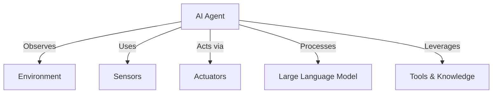
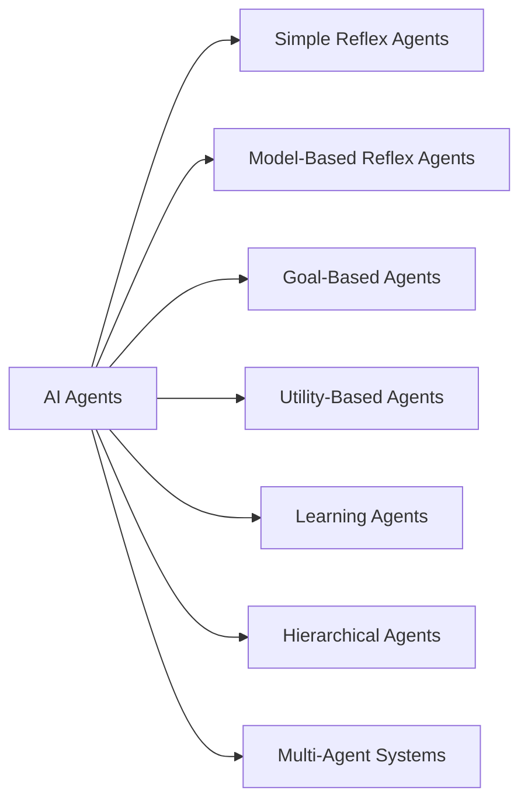
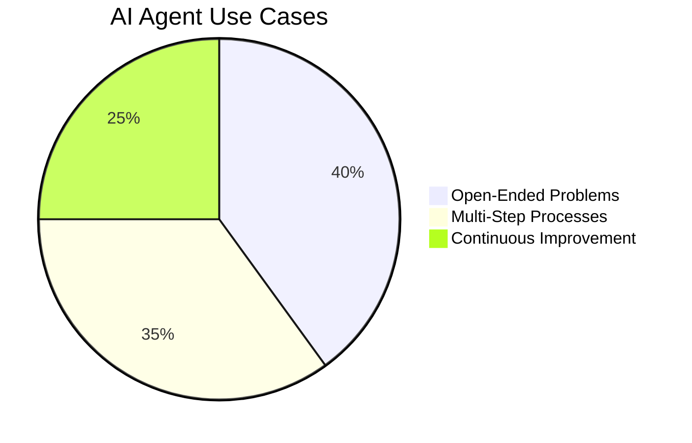

# 🤖 Introduction to AI Agents

## 📌 What are AI Agents?
AI Agents are **systems** that enable **Large Language Models (LLMs)** to **perform actions** by extending their capabilities through **tools and knowledge**.

### 📌 Key Components of an AI Agent:

| 🏗 **Component**   | 📝 **Description** |
|-------------------|-----------------|
| **Environment**   | The space where the AI Agent operates. E.g., a travel booking system. |
| **Sensors**       | Collects and interprets information from the environment. E.g., retrieving flight prices. |
| **Actuators**     | Takes action based on AI decisions. E.g., booking a flight. |
| **LLM**           | Interprets user inputs and plans actions. |
| **Tools & Knowledge** | External sources the AI Agent can access to enhance decision-making. |

---

## 🛠 Types of AI Agents
Different AI Agents serve different purposes depending on how they process information and make decisions.

| 🤖 **Agent Type**  | 📝 **Description** | 🌍 **Example** |
|-------------------|-----------------|-----------------|
| **Simple Reflex** | Acts based on predefined rules. | Auto-replying to travel inquiries. |
| **Model-Based Reflex** | Uses a model of the world to update actions. | Prioritizing routes with fluctuating prices. |
| **Goal-Based** | Plans actions to achieve a goal. | Finding the best transport options for a trip. |
| **Utility-Based** | Weighs trade-offs numerically. | Booking based on cost vs. convenience. |
| **Learning** | Improves over time with feedback. | Adjusting bookings based on user reviews. |
| **Hierarchical** | Divides tasks into subtasks. | A travel agent managing multiple bookings. |
| **Multi-Agent Systems** | Agents work together or compete. | Different agents handling hotels, flights, and activities. |

---

## 📅 When to Use AI Agents?

AI Agents are best for:
- **🧩 Open-Ended Problems**: Handling complex workflows.
- **🔄 Multi-Step Processes**: Managing long, iterative tasks.
- **📈 Continuous Improvement**: Learning from feedback.

---

## 🔧 Building AI Agents

### **Agent Development**
The first step in designing AI Agents is defining **tools, actions, and behaviors**. Modern AI Agents use platforms like **Azure AI Agent Service**, which supports:
- 🧠 OpenAI, Mistral, and Llama models
- 📊 Licensed data (e.g., Tripadvisor)
- 🔗 Standardized OpenAPI 3.0 tools

### **Agentic Patterns & Frameworks**
To ensure AI Agents operate effectively, we use **Agentic Patterns**, which allow multi-step reasoning and adaptability. Popular **Agentic Frameworks** include:
- 🏗 **AutoGen** (Research-driven)
- ⚙ **Semantic Kernel** (Production-ready)

---
