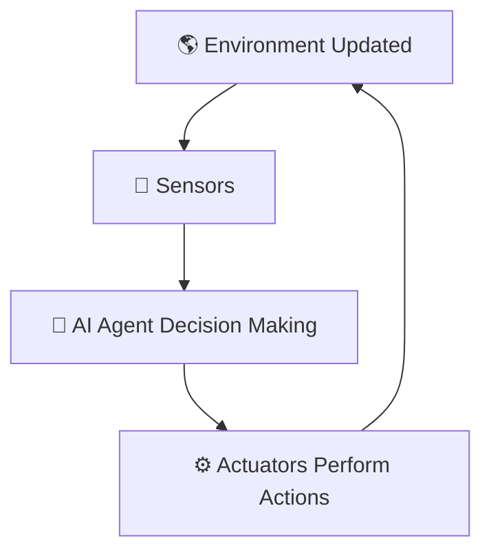
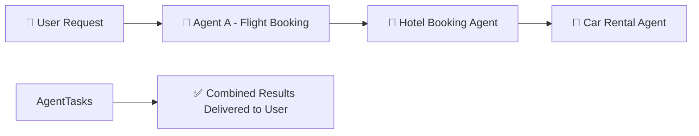
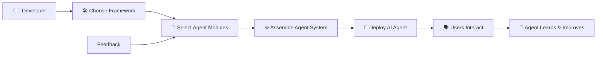
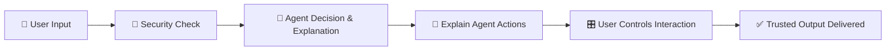

# 🤖 Introduction to AI Agents & Use Cases Explained Simply

---

## 📌 **What are AI Agents?**

An **AI Agent** is an intelligent system that uses **Large Language Models (LLMs)** enhanced by external tools and knowledge to perform specific tasks for users.

AI Agents have:

| Element | Explanation | Example (Travel Agent) |
|---------|-------------|-----------------------|
| 🌎 **Environment** | Where the agent operates | Travel booking system |
| 📡 **Sensors** | Gather information from the environment | Check flight availability |
| ⚙️ **Actuators** | Perform actions based on gathered information | Booking hotel rooms |

---

## 🎯 **Types of AI Agents**

Different types of AI agents handle tasks in distinct ways:

| Agent Type | Description | Example |
|------------|-------------|----------|
| 🔍 **Simple Reflex** | Acts based purely on current conditions | Forwarding urgent emails immediately |
| 📈 **Model-Based** | Acts based on a predefined model or scenario | Adjust route based on traffic model |
| 🎯 **Goal-Based** | Sets and achieves goals | Planning a complete trip itinerary |
| ⚖️ **Utility-Based** | Balances multiple factors to make decisions | Booking flights balancing cost and convenience |
| 📚 **Learning** | Improves through feedback | Adapting recommendations after customer reviews |

---

## 🚦 **When to Use AI Agents?**

AI agents are most effective in scenarios that are:

| Scenario | Why Use an AI Agent? | Example |
|-----------|-------------|---------|
| 🌀 **Open-Ended Problems** | Tasks without a fixed sequence | Creative content generation |
| 🔄 **Multi-Step Processes** | Complex tasks with multiple steps | Booking travel, including flights, hotels, and rentals |
| 📚 **Improving Over Time** | Agents learning and improving from experience | Customer support chatbots |

---

## 🛠️ **Basic AI Agent Structure**

An AI Agent typically includes these key components:

### 📌 **Agent Interaction Visualized:**

---

## 🌟 **Different Types of AI Agents**

| Agent Type | Description | Example |
|------------|-------------|---------|
| 📖 **Knowledge Agent** | Provides information based on data retrieval | Answering FAQs |
| 🤝 **Collaborative Agent** | Works together with humans or other agents | Scheduling team meetings |
| ⚙️ **Autonomous Agent** | Independently performs tasks without constant supervision | Self-driving car navigation |

---

## 📗 **Agentic Design Concepts**

Key principles for effective agent design include:

- 🧩 **Modularity** – Flexible, reusable components.
- 🔄 **Iterative Improvement** – Improve based on feedback.
- 🤝 **Collaboration** – Multiple agents working seamlessly.

### 📌 **Visualizing Agent Collaboration:**

---

## 🚧 **Using AI Agent Frameworks**

AI Agent frameworks simplify building agents:

| Framework | Strength | Ideal For |
|-----------|----------|-----------|
| 🧑‍🔬 **AutoGen** | Collaboration of multiple agents | Complex, multi-agent interactions |
| 📘 **Semantic Kernel** | Modular, easy integration | Enterprise applications |
| ☁️ **Azure AI Agent Service** | Scalability, Security, Integration | Large-scale enterprise use |

---

## ⚙️ **AI Agent Framework Workflow**

Typical steps when using frameworks:

### 📌 **Agent Framework Workflow Visualization:**

---

## 🔒 **Security & Trust in AI Agents**

Building trust in AI Agents involves:

| Consideration | Explanation | Practical Tip |
|---------------|-------------|---------------|
| 🔒 **Security** | Ensure safe use of data and tools | Secure APIs, restricted access |
| 🧾 **Transparency** | Clearly communicate agent behavior | Provide explanations for decisions |
| 🎛️ **User Control** | Users manage their data and interactions | Allow data deletion, preference setting |

### 📌 **Security & Trust Visual Example:**

---

## 📚 **Key Takeaways**

- **AI Agents** combine LLMs with external tools and knowledge to automate complex tasks.
- Effective agent design balances modularity, iterative improvements, and collaboration.
- AI Agent frameworks like AutoGen or Semantic Kernel streamline building and managing AI agents.
- Always prioritize security, transparency, and user control when designing agents.

---

## 🌟 **Additional Resources**

- [Azure AI Agents](https://learn.microsoft.com/azure/ai-services/agents/overview)
- [Semantic Kernel](https://learn.microsoft.com/semantic-kernel/frameworks/)
- [AutoGen](https://microsoft.github.io/autogen/)