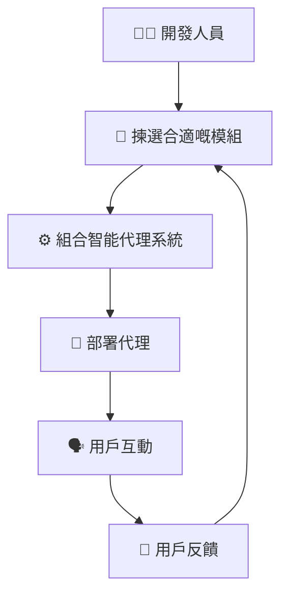
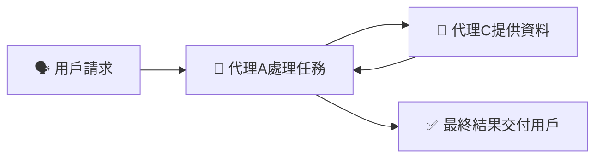
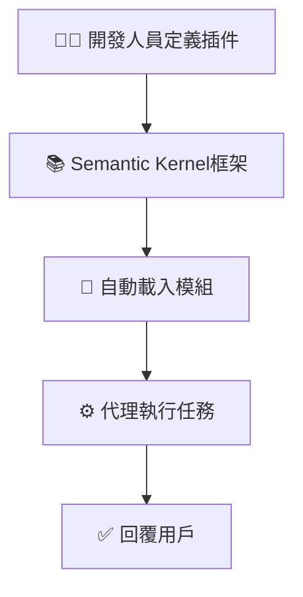
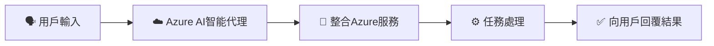
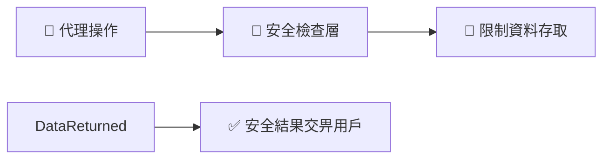

# 🤖 AI智能代理框架（簡單易明版）

---

## 📌 **咩係 AI 智能代理（AI Agent）框架？**

**智能代理框架**係一套用嚟幫助開發人員快速建立、部署同管理智能代理嘅工具同系統。透過呢啲框架，開發複雜嘅AI代理會更容易、更快速。

AI智能代理框架嘅特點包括：
- 🚀 幫助人類自動化任務（例如客服支援、數據分析）
- 📚 快速獲取同提供專業知識（例如翻譯、資料查詢）
- 🤝 促進團隊內嘅互動同協作

---

## 🎯 **點解要用 AI 智能代理框架？**

| 優點 | 解釋 | 實際例子 |
|---------|-------------|---------|
| 🚀 **效率高** | 快速建立同部署AI代理 | 快速推出客服聊天機械人 |
| 🧩 **模組化** | 可以重用嘅組件 | 語音識別、自動摘要模組 |
| 🌐 **易擴展** | 可以容易地擴展至多種應用 | 數據分析、客戶服務 |

---

## 🌐 **AI智能代理嘅運作模式**

AI智能代理透過框架嘅核心運作方式如下：

- 🧩 **模組組合**：開發人員揀選並組合現成嘅模組。
- 🚀 **快速部署**：快速部署至環境。
- 🔄 **即時反饋改善**：根據用戶回應，不斷改善代理嘅表現。

### 📌 **智能代理框架運作視覺化示例：**

---

## 🔑 **AI智能代理框架嘅主要元素**

智能代理框架嘅核心元素包括：

| 元素 | 解釋 | 實際例子 |
|---------|-------------|---------|
| 🤖 **代理間嘅協作** | 多個代理互相配合完成任務 | 團隊內不同代理合作處理訂單 |
| 🔄 **工作流程自動化** | 自動化多個步驟嘅任務 | 自動安排會議時間 |
| ⚙️ **即時適應能力** | 代理會根據即時資訊調整策略 | 根據最新天氣情況調整行程 |

---

## 📚 **主流智能代理框架比較**

以下為三種主流嘅智能代理框架比較：

| 框架 | 強項 | 最佳使用場景 |
|-----------|------------|---------------|
| 🧑‍🔬 **AutoGen** | 多代理自主協作 | 處理複雜嘅協作任務 |
| 📘 **Semantic Kernel** | 模組化，易於使用 | 快速生成文件摘要或建議 |
| ☁️ **Azure AI Agent Service** | 安全可靠、可擴展 | 企業級AI應用 |

---

## 📌 **核心框架概念視覺化**

### 🧑‍🔬 **AutoGen**

AutoGen 強調多個代理互相配合：

#### 📌 **AutoGen協作示意圖**

---

### 📘 **Semantic Kernel**

Semantic Kernel透過模組化簡化開發：

#### 📌 **Semantic Kernel操作流程**

---

### ☁️ **Azure AI Agent Service**

Azure框架提供全面、安全嘅企業級代理部署：

#### 📌 **Azure AI智能代理服務流程**

---

## 🔐 **使用AI智能代理框架嘅安全注意事項**

建立代理時，要注意以下安全考慮：

| 安全考慮 | 解釋 | 推薦做法 |
|---------------|-------------|----------------|
| 🔒 **API安全** | 確保外部資源存取安全 | 使用安全API金鑰 |
| 📂 **資料管理** | 控制資料存取權限 | 定期安全審核 |
| 🧾 **透明度** | 提供明確嘅代理決策理由 | 提供決策日誌或解釋 |

#### 📌 **安全實踐示意圖**

---

## 📚 **總結同重點**

- **AI智能代理框架** 幫助快速構建同部署AI系統，適合企業同個人。
- **AutoGen**、**Semantic Kernel** 同 **Azure AI Agent Service** 各有特色，適合唔同情境。
- 使用AI智能代理框架必須注意安全性、透明度同資料管控。

---

## 🌟 **額外參考資源**

- [Azure AI Agent官方文檔](https://learn.microsoft.com/azure/ai-services/agents/overview)
- [Semantic Kernel 官方教學](https://learn.microsoft.com/semantic-kernel/frameworks/)
- [AutoGen 官方指南](https://microsoft.github.io/autogen/)