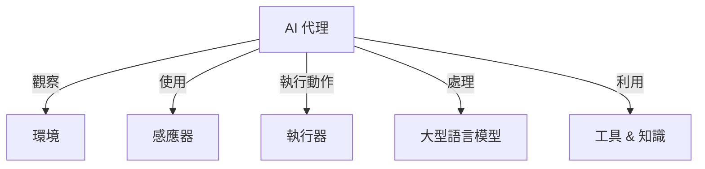
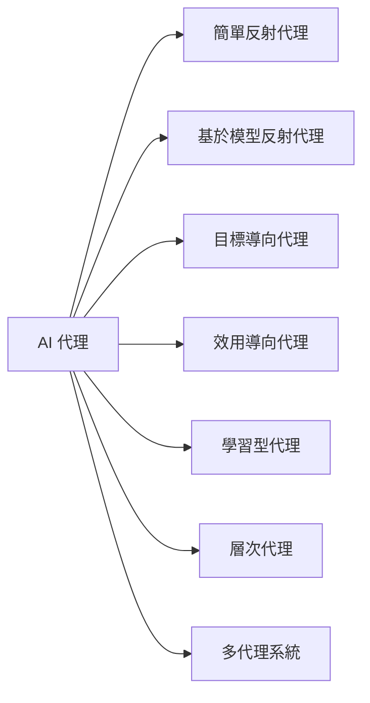
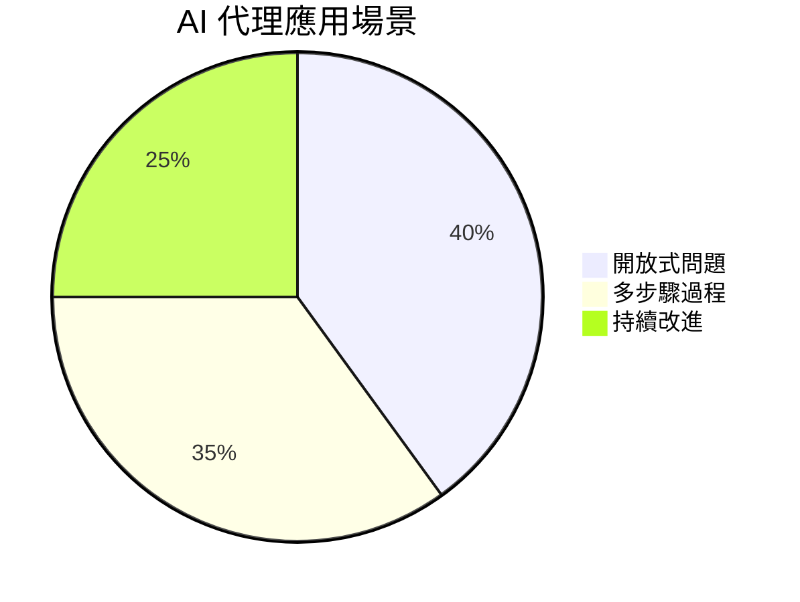

# 🤖 人工智能代理簡介

## 📌 乜嘢係 AI 代理？
AI 代理（AI Agents）係**系統**，透過**工具同知識**擴展**大型語言模型（LLMs）**嘅能力，令其可以**執行動作**。

### 📌 AI 代理嘅核心組件：

| 🏗 **組件**   | 📝 **描述** |
|--------------|-------------|
| **環境**    | AI 代理運作嘅空間，例如旅遊預訂系統。 |
| **感應器**  | 收集同解讀環境信息，例如獲取機票價格。 |
| **執行器**  | 根據 AI 決策執行動作，例如預訂機票。 |
| **LLM**     | 解讀用戶輸入並計劃動作。 |
| **工具 & 知識** | AI 代理可以訪問外部數據以增強決策能力。 |

---

## 🛠 AI 代理類型
唔同嘅 AI 代理有唔同用途，視乎佢哋點樣處理資訊同決策。

| 🤖 **代理類型**  | 📝 **描述** | 🌍 **例子** |
|---------------|----------|-------------|
| **簡單反射代理** | 根據預定規則執行動作。 | 自動回覆旅遊查詢。 |
| **基於模型反射代理** | 使用環境模型更新決策。 | 優先處理價格浮動較大嘅航線。 |
| **目標導向代理** | 根據目標計劃行動。 | 計劃最佳旅遊路線。 |
| **效用導向代理** | 計算最佳決策。 | 平衡價格與便利性預訂機票。 |
| **學習型代理** | 透過反饋改善決策。 | 根據用戶評價調整推薦。 |
| **層次代理** | 分拆任務到子任務執行。 | 旅遊代理管理多個預訂。 |
| **多代理系統** | 多個代理協作或競爭。 | 分工處理航班、住宿及活動預訂。 |

---

## 📅 何時應該使用 AI 代理？

AI 代理最適用於：
- **🧩 開放式問題**：處理複雜工作流程。
- **🔄 多步驟過程**：管理長時間、需要多次決策嘅任務。
- **📈 持續改進**：學習用戶反饋，不斷提升效能。

---

## 🔧 AI 代理嘅開發

### **代理開發**
設計 AI 代理嘅第一步係定義**工具、動作及行為**。現代 AI 代理可使用平台，例如 **Azure AI Agent Service**，支援：
- 🧠 OpenAI、Mistral、Llama 模型
- 📊 受許可數據（如 Tripadvisor）
- 🔗 標準化 OpenAPI 3.0 工具

### **代理模式與框架**
為咗確保 AI 代理能夠高效運作，我哋使用 **Agentic Patterns（代理模式）**，令 AI 代理可以進行多步推理同適應變化。常見 **代理框架** 包括：
- 🏗 **AutoGen**（研究導向）
- ⚙ **Semantic Kernel**（適用於生產環境）

---
