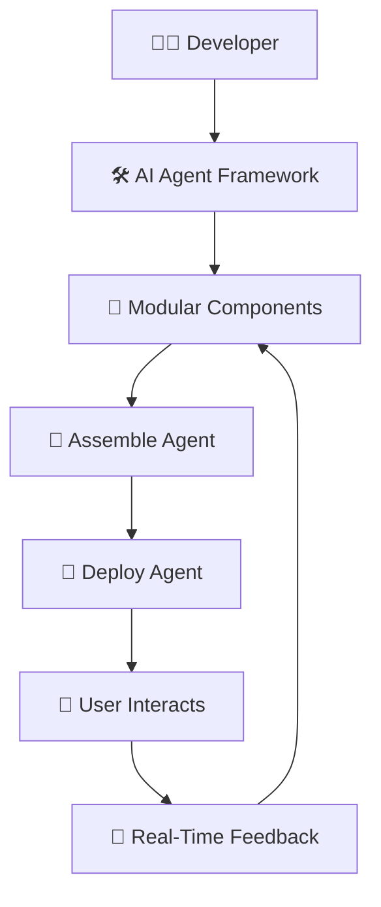
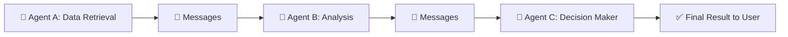
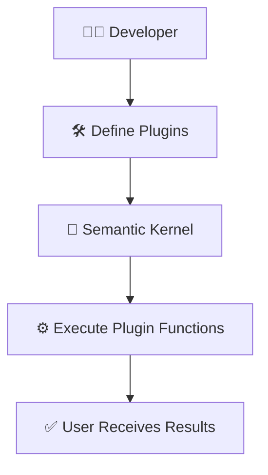
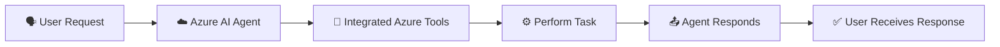
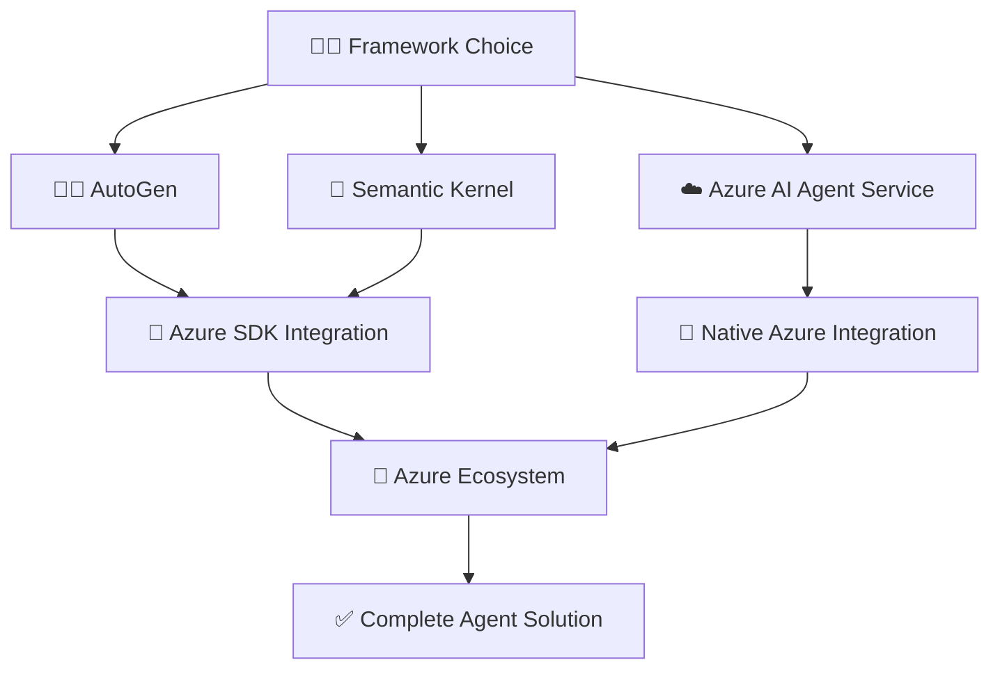

# 🤖 Exploring AI Agent Frameworks Explained Simply

---

## 📌 **What are AI Agent Frameworks?**

**AI Agent Frameworks** are software tools that simplify creating, deploying, and managing intelligent AI agents. They provide pre-built modules, tools, and standard patterns, allowing developers to quickly build complex AI systems.

---

## 🎯 **Why Use AI Agent Frameworks?**

| Benefit | Explanation | Example |
|---------|-------------|---------|
| 🚀 **Efficiency** | Quickly build and deploy agents | Rapidly building a customer support chatbot |
| 📚 **Modularity** | Reusable components save time | Pre-built modules for speech recognition or data retrieval |
| 🌐 **Scalability** | Easily scale AI systems | Handling increased user traffic without rebuilding |

---

## 🧩 **Key Capabilities of AI Agent Frameworks**

- **Agent Collaboration** 🤝: Multiple agents communicate and collaborate to complete complex tasks.
- **Task Automation** 🔄: Automate multi-step workflows, task delegation, and dynamic task management.
- **Contextual Adaptation** ⚙️: Agents adapt in real-time to user interactions and changing conditions.

---

## ⚙️ **How AI Agent Frameworks Work**

### 📌 **Visual Workflow Example:**

- Developers select pre-built modules.
- Assemble these components quickly.
- Deploy agents that users interact with.
- Agents adapt based on real-time feedback.

---

## 🔍 **Major AI Agent Frameworks Comparison**

| Framework | Core Focus | Ideal Use Case |
|-----------|------------|---------------|
| 🧑‍🔬 **AutoGen** | Multi-agent experimentation and research | Quickly prototype complex agent systems |
| 📘 **Semantic Kernel** | Production-ready agent orchestration and automation | Build enterprise-ready AI applications |
| ☁️ **Azure AI Agent Service** | Enterprise-scale secure deployment and integration | Scalable, secure, and flexible AI agent deployments |

---

## 📚 **Key Concepts Explained Visually**

### 🧑‍🔬 **AutoGen**

AutoGen enables multiple agents to communicate and solve complex tasks through asynchronous messaging.

#### 📌 **AutoGen Multi-Agent Interaction:**

---

### 📘 **Semantic Kernel**

Semantic Kernel simplifies AI orchestration by integrating modular plugins and connectors.

#### 📌 **Semantic Kernel Workflow:**

---

### ☁️ **Azure AI Agent Service**

Azure AI Agent Service integrates enterprise-grade security and scalability with Azure's AI tools.

#### 📌 **Azure AI Agent Service Interaction:**

---

## 🚨 **Integrating with Azure Ecosystem**

You can integrate your existing Azure tools directly:

- **AutoGen & Semantic Kernel**: Requires coding integrations using Azure SDKs.
- **Azure AI Agent Service**: Seamlessly integrates Azure tools like Azure OpenAI, Azure Functions, and Azure AI Search.

### 📌 **Azure Integration Visualization:**

---

## 📚 **Summary & Key Points**

- AI Agent Frameworks help build, manage, and scale intelligent agents efficiently.
- Major frameworks: **AutoGen** (experimental), **Semantic Kernel** (enterprise orchestration), and **Azure AI Agent Service** (enterprise-grade secure deployment).
- Integrating with Azure provides additional powerful tools and scalability.

---

## 🌟 **Additional Resources**

- [Azure AI Agent Service](https://learn.microsoft.com/azure/ai-services/agents/overview)
- [Semantic Kernel Documentation](https://learn.microsoft.com/semantic-kernel/frameworks/)
- [AutoGen Documentation](https://microsoft.github.io/autogen/)