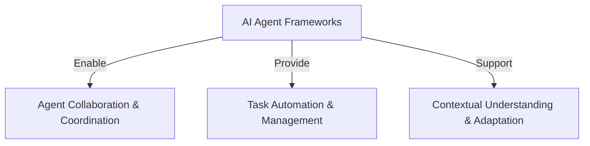
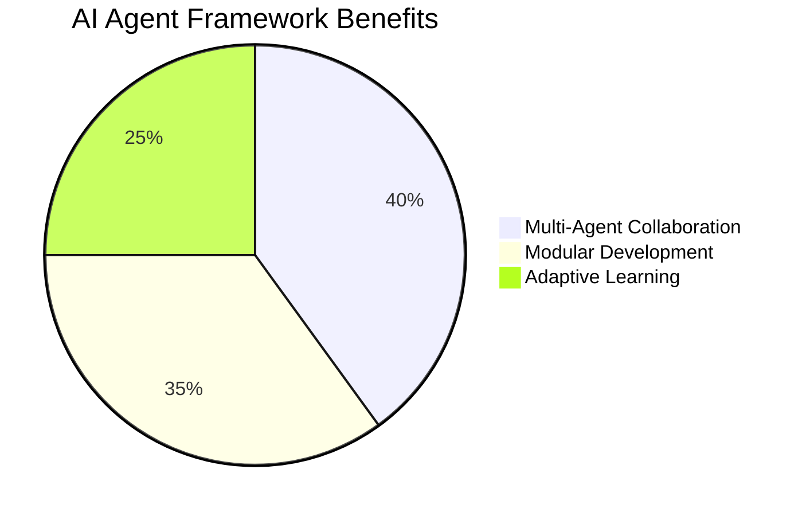
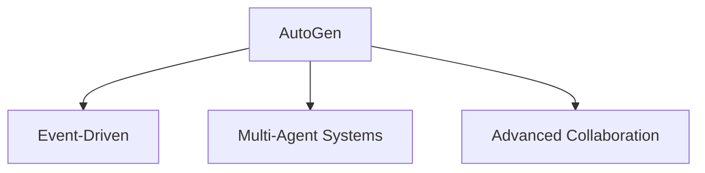
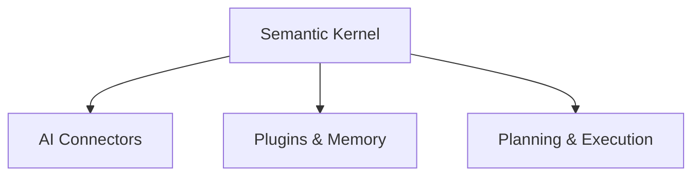
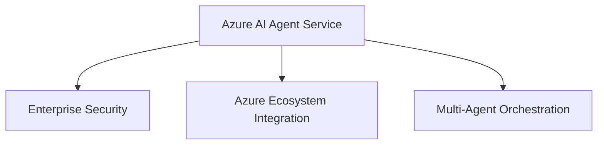
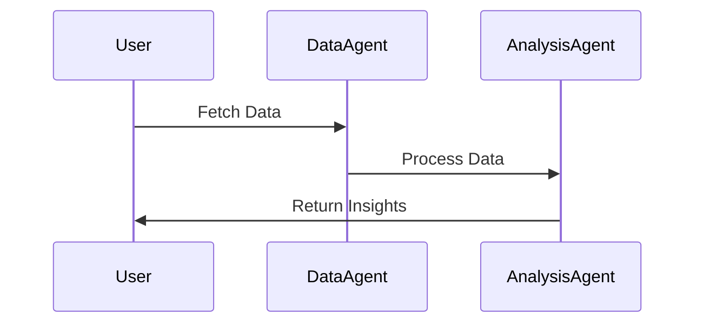
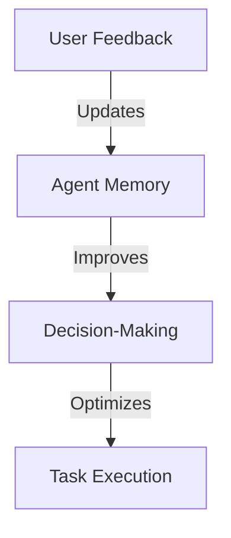

# 🤖 AI Agent Frameworks Explained

## 📌 What are AI Agent Frameworks?
AI Agent Frameworks are **software platforms** designed to simplify the **creation, deployment, and management** of AI agents. These frameworks provide **pre-built components**, **abstractions**, and **tools** to streamline development.

### 🔑 Key Capabilities of AI Agent Frameworks:

| 🏗 **Feature**  | 📝 **Description** |
|---------------|-----------------|
| **Agent Collaboration** | Multiple AI agents working together to solve complex tasks. |
| **Task Automation** | Automating workflows, delegating tasks, and managing dynamic processes. |
| **Contextual Understanding** | Adapting to real-time information and decision-making. |

---

## 🚀 Why Use AI Agent Frameworks?

AI Agent Frameworks extend beyond traditional AI by enabling:

- 🤝 **Multi-Agent Systems**: Agents interact with each other and the environment.
- 🏗 **Modular Components**: Pre-built AI connectors, memory management, and plugins.
- 🔄 **Real-Time Learning**: Agents dynamically improve based on feedback.

---

## 🔧 AI Agent Frameworks: AutoGen, Semantic Kernel, Azure AI Agent Service

### 1️⃣ **AutoGen**

**🔹 Open-source framework by Microsoft Research**  
- Best for **experimentation & multi-agent collaboration**.  
- Focused on **distributed, event-driven AI applications**.

### 2️⃣ **Semantic Kernel**

**🔹 AI orchestration SDK**  
- Ideal for **production-ready enterprise agent applications**.  
- Supports **agent plugins, planning, memory, and native functions**.

### 3️⃣ **Azure AI Agent Service**

**🔹 Enterprise-grade agent deployment platform**  
- **Integrates with Azure** (Azure AI Search, Bing Search, etc.).  
- Focused on **secure, scalable AI solutions**.

| 🔍 **Framework** | 🔧 **Focus** | 🔥 **Use Cases** |
|---------------|------------|-----------------|
| **AutoGen** | Research & multi-agent experimentation | Advanced agent collaboration, code generation, and planning. |
| **Semantic Kernel** | AI orchestration & production deployment | Business automation, natural language understanding, and workflow management. |
| **Azure AI Agent Service** | Secure enterprise AI solutions | AI agent deployment at scale with Azure tools & integration. |

---

## 🛠 Quick Prototyping & Iteration

### **Using Modular Components**
- AI SDKs provide **pre-built functions** for easy prototyping.
- Example: **Semantic Kernel** for AI connectors, memory, and plugins.

### **Collaborative Tools**
- Frameworks like **CrewAI & AutoGen** allow agents to interact.
- Agents can specialize in **data retrieval, analysis, & decision-making**.

### **Real-Time Learning & Adaptation**
- Agents improve based on **feedback loops**.
- Example: **Azure AI Agent Service** continuously refines workflows.

---

## 🏆 Choosing the Right Framework

| 💡 **Scenario** | ✅ **Recommended Framework** |
|---------------|-------------------|
| **I want to experiment with multi-agent AI.** | AutoGen |
| **I need a production-ready AI orchestration system.** | Semantic Kernel |
| **I want enterprise security & Azure integration.** | Azure AI Agent Service |

---