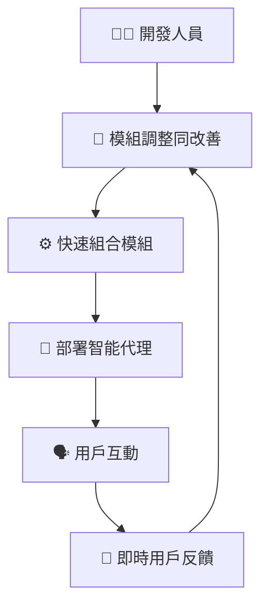
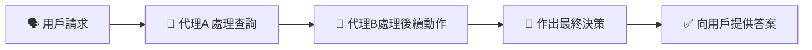
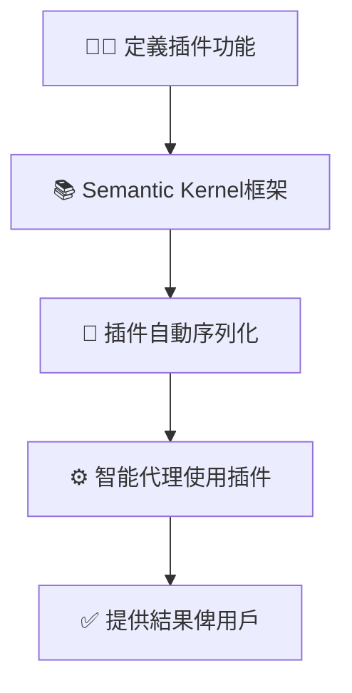
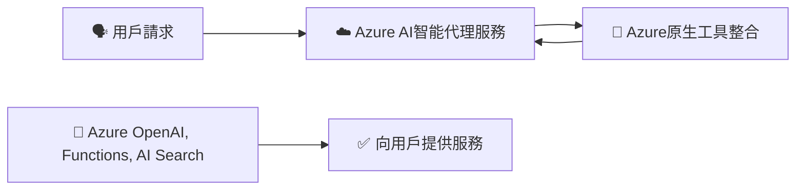
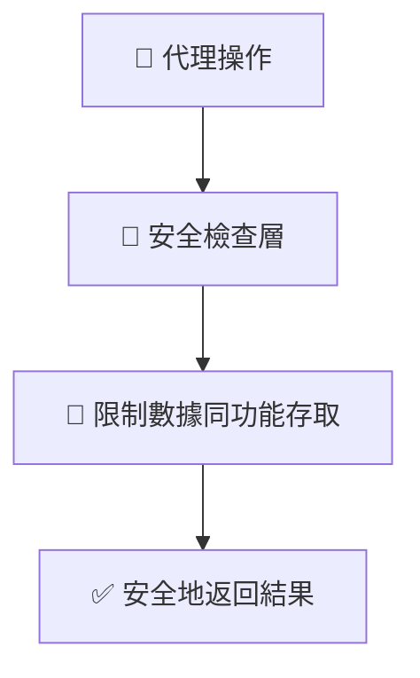

# 🛠️ AI智能代理框架設計模式（簡單易明版）

---

## 📌 **咩係AI智能代理框架（Agent Frameworks）？**

AI智能代理框架係指一套工具或者系統，開發者可透過呢啲框架，快速建立複雜嘅智能代理，完成各種任務，令AI更易融入日常工作同生活。

智能代理框架能夠：
- 🚀 自動處理任務
- 📚 快速提供知識同資訊
- 🤝 促進合作與互動
- 📈 增強用戶嘅個人能力

---

## 🎯 **點解要用智能代理框架？**

| 優點 | 解釋 | 實際例子 |
|---|---|---|
| 🚀 **提高效率** | 快速建立同部署智能代理 | 快速製作客服聊天機械人 |
| 🧩 **模組化** | 組件可以獨立重用 | 現成嘅AI功能，例如自動總結文件 |
| 🔄 **快速擴展** | 容易擴展至大規模應用 | 大型企業嘅AI客服系統 |

---

## ⚙️ **智能代理框架嘅核心元素**

智能代理框架通常包括以下元素：

- 🤖 **代理溝通**：多個代理可互相協作，完成複雜任務。
- 🔄 **工作流自動化**：自動化執行任務及工作流程。
- 🌐 **即時適應**：根據用戶嘅反饋同情境即時調整策略。

---

## 🛠️ **智能代理框架嘅運作模式**

開發人員可透過智能代理框架嘅模組快速組合及部署：

### 📌 **視覺化智能代理框架運作流程**：

---

## 📚 **主流智能代理框架比較**

| 框架 | 優點 | 最適合使用場景 |
|-----------|------------|---------------|
| 🧑‍🔬 **AutoGen** | 多代理自主協作、容易擴展 | 實驗性、多代理系統研究 |
| 📘 **Semantic Kernel** | 模組化容易用 | 企業內快速構建智能應用 |
| ☁️ **Azure AI Agent Service** | 企業級安全整合，同Azure平台原生集成 | 大型企業部署 |

---

## 🔍 **核心概念視覺化解說**

### 🧑‍🔬 **AutoGen**

AutoGen支持多個智能代理協作：

### 📌 **AutoGen代理互動流程圖**：

---

### 📘 **Semantic Kernel**

Semantic Kernel 提供模組化插件，簡化智能代理嘅設計同操作：

### 📌 **Semantic Kernel框架流程圖**：

---

### ☁️ **Azure AI Agent Service**

Azure AI Agent Service 專注企業級部署，提供高度安全性同可擴展性：

### 📌 **Azure AI智能代理服務流程圖**：

---

## 🚧 **智能代理框架嘅安全同整合注意事項**

透過智能代理框架整合時，需注意以下安全措施：

| 注意事項 | 解釋 | 實踐建議 |
|---------------|-------------|----------------|
| 🔐 **安全API整合** | 確保API使用安全 | 使用受保護嘅API Key |
| 📁 **數據安全** | 控制數據訪問權限 | 設定安全存取權限 |
| ⚠️ **敏感操作監督** | 設定明確權限同監督 | 重要決策須人類確認 |

### 📌 **安全實踐示例**：

---

## 📚 **總結及重點**

- 使用智能代理框架能快速構建同部署AI應用，節省大量時間。
- 各框架有唔同特點，選擇框架需視乎應用需求。
- 安全性同模組化係智能代理框架嘅重要考量因素。

---

## 🌟 **額外參考資源**

- [Azure AI Agent Service 官方文件](https://learn.microsoft.com/azure/ai-services/agents/overview)
- [Semantic Kernel 官方指南](https://learn.microsoft.com/semantic-kernel/frameworks/)
- [AutoGen 官方文件](https://microsoft.github.io/autogen/)