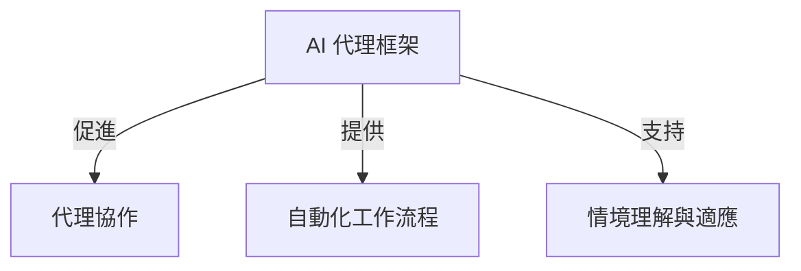
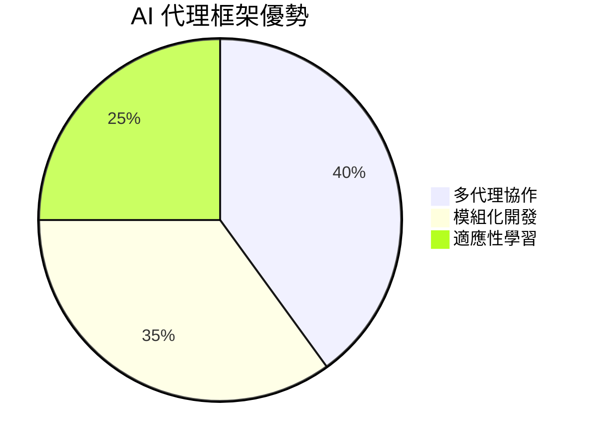
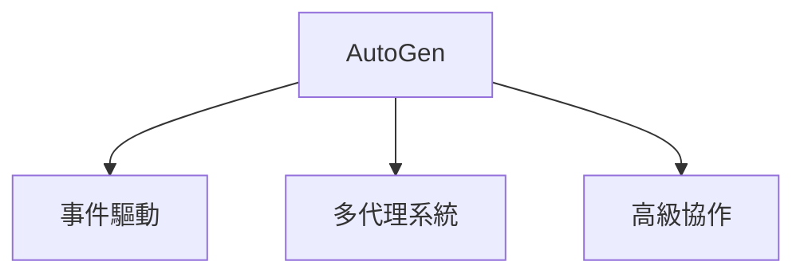
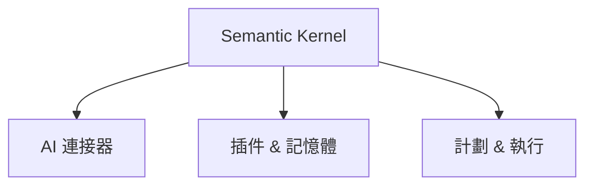
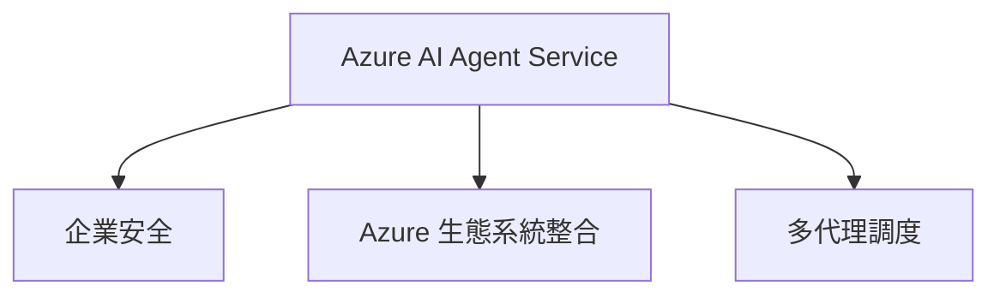
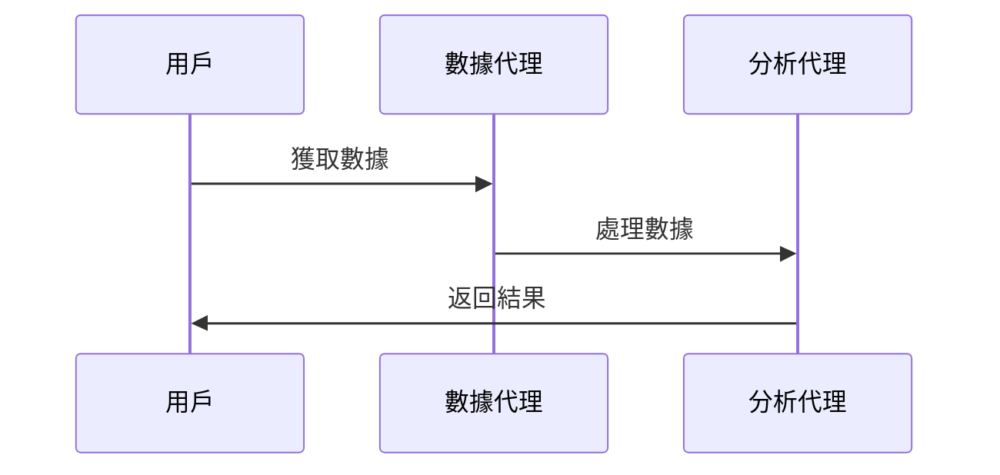
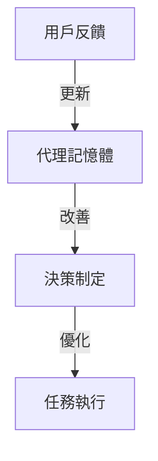

# 🀄 AI 代理框架簡介

## 📌 乜嘢係 AI 代理框架？
AI 代理框架（AI Agent Frameworks）係**軟件平台**，用來簡化**AI 代理**嘅**開發、部署同管理**。呢啲框架提供**預建組件**、**抽象層**同**工具**，令開發更加簡單。

### 🔑 AI 代理框架嘅主要功能：

| 🏗 **功能**  | 📝 **描述** |
|-------------|-----------------|
| **代理協作** | 多個 AI 代理協作解決問題。 |
| **自動化工作** | 自動化處理多步驟任務。 |
| **情境理解** | 根據環境資訊作出適應性決策。 |

---

## 🚀 點解要用 AI 代理框架？

AI 代理框架除咗傳統 AI 之外，仲提供以下功能：

- 🤝 **多代理系統**：代理互相溝通，處理複雜任務。
- 🏗 **模組化組件**：提供預建 AI 連接器、記憶管理同插件。
- 🔄 **即時學習**：代理根據用戶反饋動態改善。

---

## 🔧 AI 代理框架對比：AutoGen、Semantic Kernel、Azure AI Agent Service

### 1️⃣ **AutoGen**

**🔹 由 Microsoft Research 開發嘅開源框架**  
- 最適合**實驗性 AI 代理系統**同**多代理協作**。  
- 聚焦於**分佈式、事件驅動 AI 應用**。

### 2️⃣ **Semantic Kernel**

**🔹 AI 調度 SDK**  
- 適用於**生產級企業 AI 代理應用**。  
- 支援**插件、計劃、記憶體管理及原生函數**。

### 3️⃣ **Azure AI Agent Service**

**🔹 企業級 AI 代理部署平台**  
- **與 Azure 生態系統整合**（如 Azure AI 搜索、Bing 搜索等）。  
- 專注於**安全、可擴展 AI 解決方案**。

| 🔍 **框架** | 🔧 **重點** | 🔥 **應用場景** |
|-----------|-----------|-----------------|
| **AutoGen** | 研究型 & 多代理系統 | 進階代理協作、代碼生成、計劃與分析。 |
| **Semantic Kernel** | AI 調度 & 生產部署 | 業務自動化、自然語言理解、工作流管理。 |
| **Azure AI Agent Service** | 企業級 AI 解決方案 | 企業級 AI 代理部署，與 Azure 工具整合。 |

---

## 🛠 快速原型開發 & 迭代

### **模組化組件**
- AI SDK 提供**預建函數**，方便快速原型開發。
- 例如：**Semantic Kernel** 提供 AI 連接器、記憶體管理及插件。

### **協作工具**
- 框架如 **CrewAI & AutoGen** 支援多代理互動。
- 代理可專門處理 **數據檢索、分析、決策**。

### **即時學習 & 適應**
- 代理根據**反饋回路**進行改進。
- 例如 **Azure AI Agent Service** 會不斷優化工作流程。

---

## 🏆 如何選擇適合嘅框架？

| 💡 **情境** | ✅ **推薦框架** |
|-----------|---------------|
| **想探索多代理 AI？** | AutoGen |
| **需要穩定生產環境？** | Semantic Kernel |
| **企業級安全與 Azure 整合？** | Azure AI Agent Service |

---