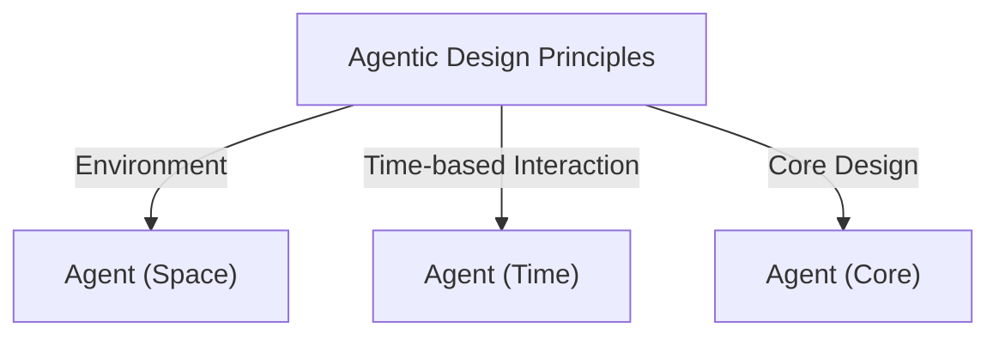
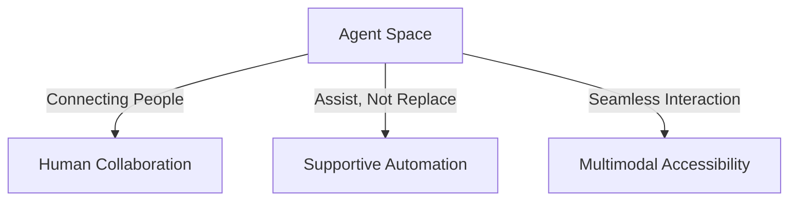
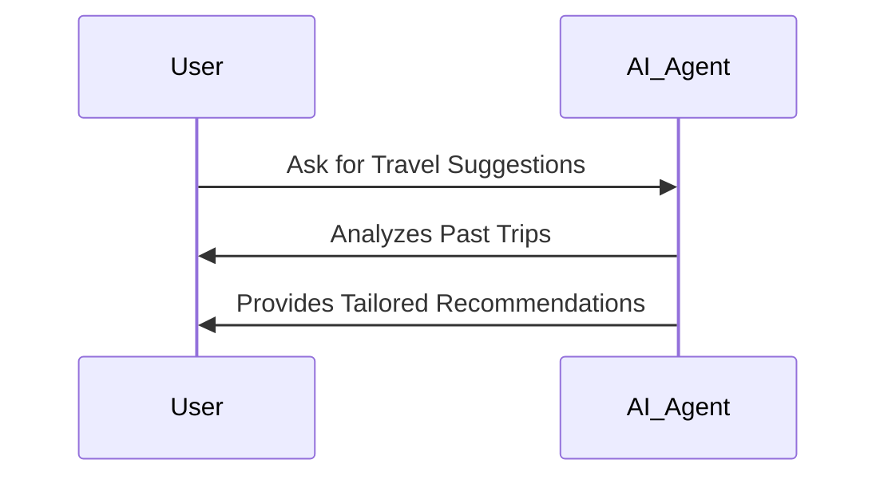
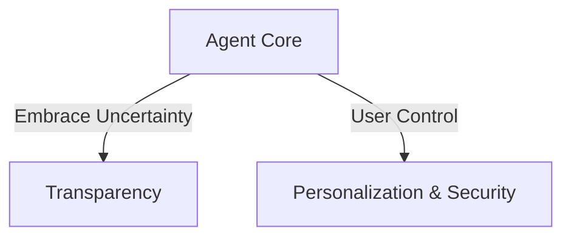
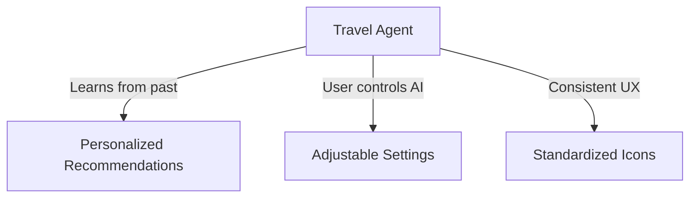

# 🤖 AI Agentic Design Principles

## 📌 Introduction
AI Agentic Systems are designed to **broaden human capabilities** by facilitating problem-solving, collaboration, and automation. These principles help developers create **customer-centric agentic systems** that align with human needs.

### 🏗 **Key Design Principles**

| 🏗 **Principle** | 🔍 **Description** |
|----------------|------------------|
| **Agent (Space)** | Defines how agents interact in physical and digital environments. |
| **Agent (Time)** | Guides agent behavior over past, present, and future interactions. |
| **Agent (Core)** | Establishes trust, transparency, and control over AI agent behavior. |

---

## 🌍 **Agent (Space)**
**How agents operate within digital and physical spaces.**
- **🔗 Connecting, not collapsing** – Facilitate human collaboration, not replace it.
- **👀 Easily accessible yet occasionally invisible** – Agents operate in the background but engage users when necessary.

---

## ⏳ **Agent (Time)**
**How agents function across different timeframes.**
- **📜 Past:** Learn from history to provide relevant recommendations.
- **📌 Now:** Notify and guide users effectively without overwhelming them.
- **🔮 Future:** Adapt, evolve, and personalize based on continuous user interaction.

---

## 🏗 **Agent (Core)**
**Fundamental aspects that define an AI agent’s trustworthiness.**
- **🤝 Embrace Uncertainty but Establish Trust** – Transparency is key.
- **🔍 Human in Control** – Users can adjust, turn off, or modify agent behaviors.

---

## ✅ **Guidelines for Implementing Agentic Principles**
| 🔹 **Guideline**  | 📝 **Best Practice** |
|------------------|-------------------|
| **Transparency** | Clearly inform users when AI is involved. Show history & allow feedback. |
| **Control** | Let users customize AI behavior, writing style, and delete stored data. |
| **Consistency** | Provide a uniform UI/UX experience across platforms. |

---

## ✈ **Example: Travel Agent Design**
**Applying Agentic Principles to a Travel AI Assistant:**
1. **Transparency** – Display past interactions & allow feedback.
2. **Control** – Let users adjust verbosity & delete conversation history.
3. **Consistency** – Use standard UI elements like icons for sharing, tagging, and file uploads.

---

## 📚 **Additional Resources**
- [OpenAI’s Guidelines on Agentic AI](https://openai.com)
- [Microsoft’s HAX Toolkit](https://microsoft.com)
- [Responsible AI Toolbox](https://responsibleaitoolbox.ai)