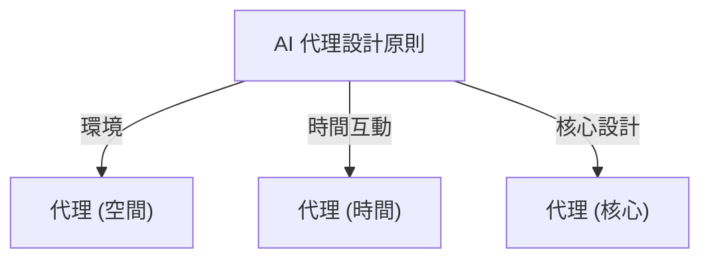
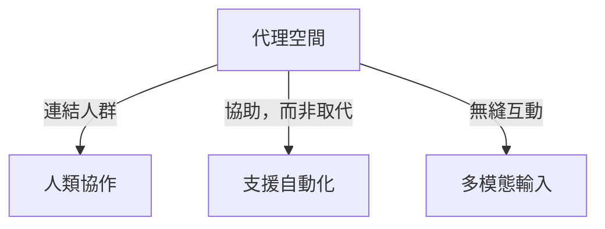
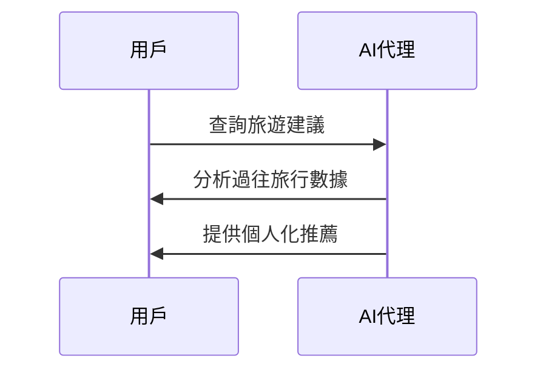
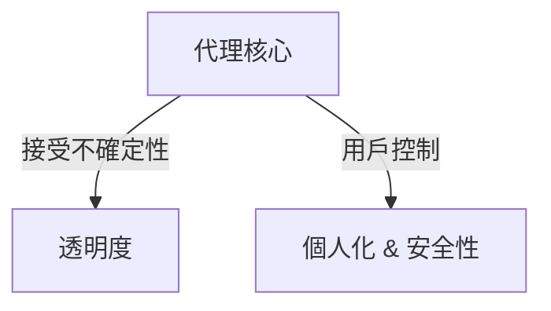
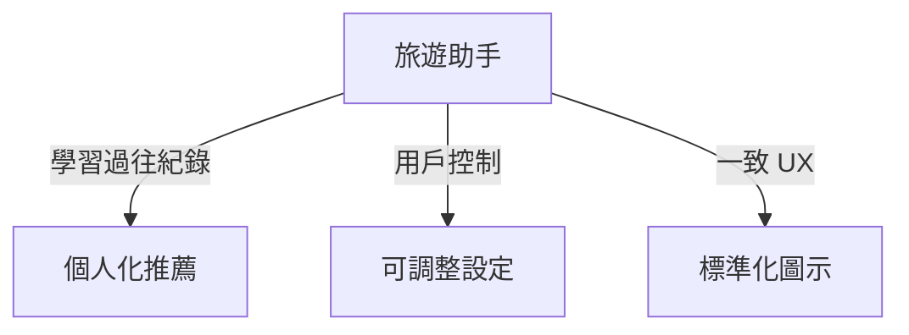

# 🤖 AI 代理設計原則

## 📌 介紹
AI 代理系統係用嚟**擴展人類能力**，幫助解決問題、促進協作同自動化。呢啲設計原則幫助開發人員**建立以用戶為中心**嘅 AI 代理系統。

### 🏗 **設計原則**

| 🏗 **原則** | 🔍 **描述** |
|----------------|------------------|
| **代理 (空間)** | 設計 AI 代理點樣喺數碼同物理世界互動。 |
| **代理 (時間)** | 指導代理點樣處理過去、現在同未來嘅互動。 |
| **代理 (核心)** | 確保 AI 代理透明度、信任同用戶控制。 |

---

## 🌍 **代理 (空間)**
**AI 代理喺不同環境嘅運作方式。**
- **🔗 連結，而唔係取代** – 幫助人與人合作，而唔係取代佢哋。
- **👀 易於存取但唔會打擾** – 代理通常喺背景運作，適時通知用戶。

---

## ⏳ **代理 (時間)**
**AI 代理點樣喺時間上運作。**
- **📜 過去:** 代理學習歷史數據，提供更相關建議。
- **📌 現在:** 提供適時提醒，而唔係過度通知。
- **🔮 未來:** 自動適應用戶行為，不斷學習同進化。

---

## 🏗 **代理 (核心)**
**確保 AI 代理安全同可信賴嘅基本原則。**
- **🤝 接受不確定性但建立信任** – 透明度係關鍵。
- **🔍 用戶可控制** – 代理行為可以由用戶調整或關閉。

---

## ✅ **設計 AI 代理時需遵循嘅準則**
| 🔹 **準則**  | 📝 **最佳做法** |
|------------------|-------------------|
| **透明度** | 讓用戶清楚知道 AI 介入，顯示歷史記錄並允許反饋。 |
| **控制** | 讓用戶自訂 AI 行為，調整風格，並刪除存儲數據。 |
| **一致性** | 提供跨平台一致嘅 UI/UX 體驗。 |

---

## ✈ **示例：設計旅遊 AI 助手**
**應用代理設計原則到旅遊助手：**
1. **透明度** – 展示過往互動並允許用戶反饋。
2. **控制** – 讓用戶調整 AI 設定，刪除對話歷史。
3. **一致性** – 使用標準 UI 元素，例如文件上傳、標籤圖示。

---

## 📚 **額外資源**
- [OpenAI 嘅代理 AI 指南](https://openai.com)
- [Microsoft HAX 工具包](https://microsoft.com)
- [負責任 AI 工具箱](https://responsibleaitoolbox.ai)