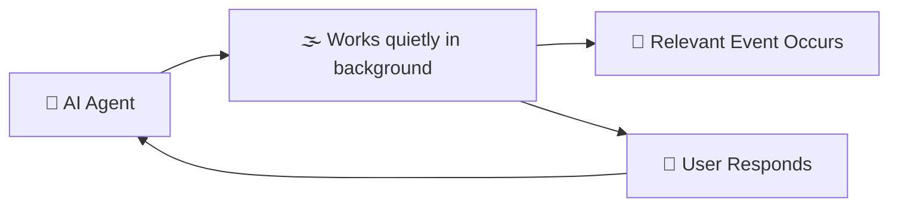
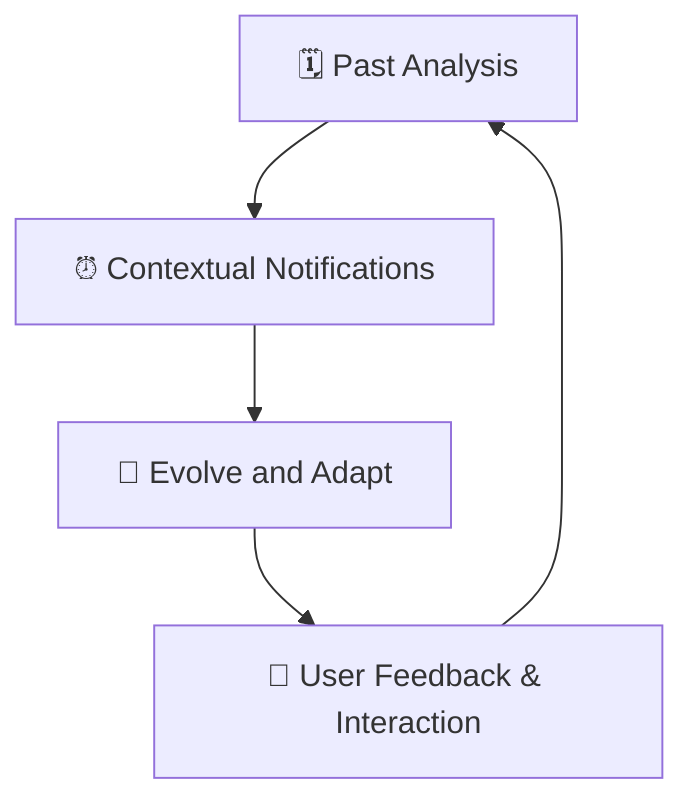
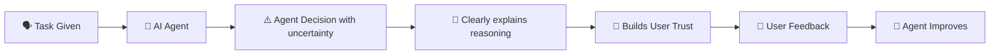
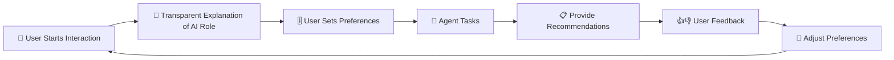

# 🧩 Understanding Agentic Design Principles Explained Simply

---

## 📌 **What are AI Agentic Design Principles?**

These principles guide the design of AI agents to support, enhance, and empower human interactions while handling tasks that involve complexity, ambiguity, and ongoing interactions.

Agents should:
- 🔍 Extend human abilities (e.g., automate tasks, solve problems)
- 📚 Fill knowledge gaps (translations, providing quick summaries)
- 🤝 Support collaborative interactions effectively
- 🌟 Enhance personal capabilities (making people better at tasks)

---

## 🎯 **Why AI Agentic Design Matters**

| Benefit | Explanation | Example |
|---------|-------------|---------|
| 🚀 **Scaling Human Abilities** | Agents extend human capabilities | Automating repetitive tasks |
| 📖 **Knowledge Support** | Quickly fill gaps in human knowledge | Translating documents instantly |
| 🤝 **Collaboration** | Enhance teamwork and communication | Coordinating remote teams |
| 🌟 **Personal Growth** | Help users improve themselves | Personalized productivity coaching |

---

## 🌐 **Agent Design Principles Explained**

### 🛰️ **Agent (Environment Interaction)**

AI agents should be designed to fit naturally into daily interactions:

- **Connecting, not replacing**: Agents connect knowledge, events, and people.
- **Invisible but accessible**: Agents work quietly in the background, interacting only when necessary.

### 📌 **Agent Interaction Flow:**

---

### 🕒 **Agents Across Time**

Agents operate considering past, present, and future contexts:

| Time | Agent Role | Example |
|------|------------|---------|
| 🗓️ **Past** | Reflect and analyze history/context | Reviewing past meetings to prepare reports |
| ⏰ **Present** | Provide relevant context-based notifications | Reminding you of urgent emails |
| 🚀 **Future** | Adapt and evolve through interactions | Learning user preferences for future tasks |

### 📌 **Visualizing Time Interaction:**

---

## 🔑 **Core Elements of AI Agent Design**

| Element | Explanation | Example |
|---------|-------------|---------|
| 🌫️ **Embrace Uncertainty** | Some ambiguity is acceptable; it allows flexibility | Agent refines its actions based on new information |
| 🔒 **Establish Trust** | Trust through transparency & clear operation | Explaining why an action was taken clearly |

### 📌 **Trust & Uncertainty Management Flow:**

---

## ⚙️ **Guidelines for Building Trustworthy AI Agents**

To build trustworthy AI agents, follow these principles clearly:

| Guideline | Explanation | Example (Travel Agent) |
|-----------|-------------|-----------------------|
| 🧾 **Transparency** | Clearly explain AI actions and how users can interact or give feedback | Agent clearly states it’s an AI and provides instructions |
| 🎛️ **Control** | Users control personalization, preferences, and data management | Users control agent's verbosity and can delete conversations |
| 🔄 **Consistency** | Provide a predictable, seamless experience across interactions and modes | Standard user experience in text, voice, or visual interactions |

---

## 🗺️ **Example: Building an AI Travel Agent**

Applying principles to create a user-friendly Travel AI Agent:

| Principle | Application |
|-----------|-------------|
| 🧾 **Transparency** | Clearly state it’s an AI agent with easy-to-understand onboarding instructions |
| 🎚️ **User Control** | Allow users to set agent’s style, interaction type, and delete data |
| 🎯 **Consistency** | Standard icons for actions (📅 booking, ✈️ flights, 🏨 hotels) |

### 📌 **Travel Agent Interaction Diagram:**

---

## 📚 **Summary & Key Points**

- AI Agentic Design helps agents integrate naturally into daily tasks.
- Embracing uncertainty improves flexibility but must maintain user trust.
- Transparency, user control, and consistency are essential for building trusted AI agents.

---

## 🌟 **Additional Resources**

- [OpenAI Practices for Governing AI Agents](https://openai.com)
- [HAX Toolkit - Microsoft Research](https://microsoft.com)
- [Responsible AI Toolbox](https://responsibleaitoolbox.ai)