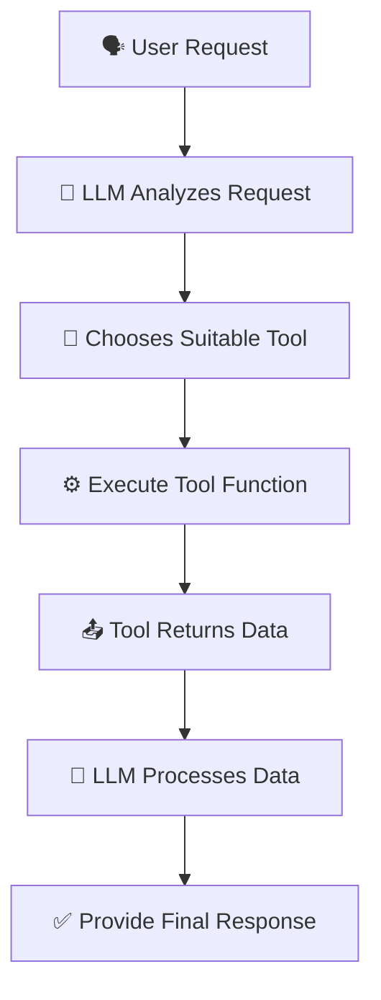
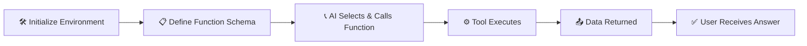
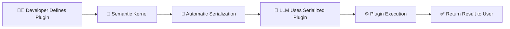
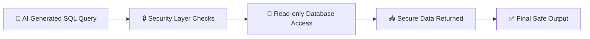

# 🛠️ AI Agent Tool Use Design Pattern Explained Simply

---

## 📌 **What is the Tool Use Design Pattern?**

The **Tool Use Design Pattern** allows AI agents to expand their capabilities by using external tools (functions or APIs) to accomplish specific tasks.

For example, an AI agent might:
- 🧮 Perform calculations with a calculator tool
- 📊 Retrieve real-time data using APIs (stock prices, weather forecasts)
- 🗃️ Query databases to get specific information

---

## 🎯 **Use Cases for Tool Use Design Pattern**

| Scenario | Description | Example |
|---|---|---|
| 📡 **Dynamic Information Retrieval** | Fetch real-time data | Stock prices, weather information |
| 🧑‍💻 **Code Execution & Interpretation** | Run scripts or analyze data | Solve math problems, data analysis |
| 🔄 **Workflow Automation** | Automate multi-step processes | Scheduling tasks, sending emails |
| 🙋 **Customer Support** | Interact with CRM and knowledge bases | Resolving user queries automatically |
| ✍️ **Content Generation & Editing** | Create or enhance content | Grammar checking, summarizing texts |

---

## 🧱 **Core Elements of Tool Use Design Pattern**

These building blocks help AI agents use external tools effectively:

| Element | Description | Example |
|---|---|---|
| 📞 **Function/Tool Calling** | Agent identifies and calls the correct tool | Calling an API to get current time |
| 📥 **Dynamic Information Retrieval** | Fetch up-to-date data from external sources | Getting live stock quotes |
| 🖥️ **Code Execution** | Execute code to solve problems | Running Python scripts |
| 🔁 **Workflow Automation** | Manage multiple automated steps | Automatically sending reminder emails |
| 💬 **CRM & Customer Interaction** | Interacting with customer support systems | Accessing user tickets |
| 📝 **Content Tools** | Editing and enhancing text content | Using grammar checkers |

---

## ⚙️ **How Tool/Function Calling Works**

Function calling is how an AI agent selects and uses tools:

### 📌 **Process Overview:**

- User makes a request (e.g., "What's the current time in San Francisco?").
- AI selects the best tool (function) for the task.
- Tool executes and provides results back to the AI.
- AI processes results and gives a clear response.

---

## 🖥️ **Tool Implementation Visual Example**

An agent might perform this step-by-step:

- **Initialize** AI environment (e.g., Azure OpenAI)
- **Define** function descriptions clearly (schemas)
- **Execute** the selected function automatically
- **Provide** clear, structured results back to users

### 📌 **Visualization of Implementation:**

---

## 🔧 **Tool Use Examples with Frameworks**

Agentic frameworks simplify the process of using tools:

| Framework | Advantages | Use Case |
|-----------|------------|----------|
| 🧩 **Semantic Kernel** | Easy setup and built-in functions | Automated document summarization |
| ☁️ **Azure AI Agent Service** | Managed infrastructure and secure integration | Enterprise-level CRM automation |

### 📌 **Framework Workflow (Semantic Kernel Example):**

---

## 🚨 **Trustworthiness & Security Considerations**

Security is critical for AI agents using external tools:

| Consideration | Explanation | Recommendation |
|---------------|-------------|----------------|
| 🚫 **Prevent SQL Injection** | Protect databases from malicious commands | Limit database access (read-only roles) |
| 🔒 **Secure Environment** | Operate tools securely | Run applications in secure, isolated environments |
| 📚 **Data Governance** | Control data access and maintain compliance | Regular data audits and access control |

### 📌 **Security Best Practice Visualization:**

---

## 📚 **Key Takeaways**

- **Tool Use Pattern** expands AI capabilities dramatically.
- External tools automate tasks and enhance agent efficiency.
- Clear schema definitions help AI accurately select and execute tools.
- Security measures ensure trustworthiness when using external tools.

---

## 🌟 **Additional Resources**

- [Azure AI Agents Workshop](https://microsoft.github.io/build-your-first-agent-with-azure-ai-agent-service-workshop/)
- [Semantic Kernel Tutorials](https://learn.microsoft.com/semantic-kernel/concepts/ai-services/chat-completion/function-calling/?pivots=programming-language-python)
- [Autogen Tools Guide](https://microsoft.github.io/autogen/dev/user-guide/core-user-guide/components/tools.html)