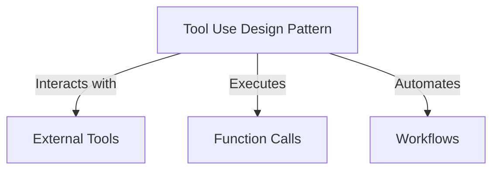
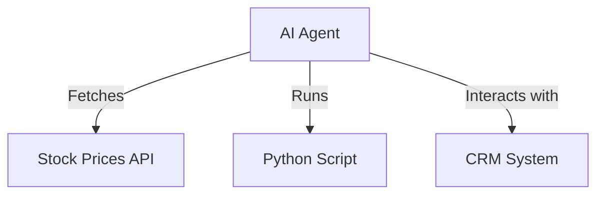
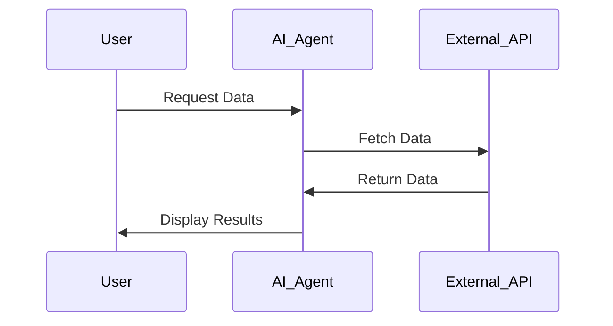

# 🔧 Tool Use Design Pattern

## 📌 Introduction
The **Tool Use Design Pattern** expands AI agents' capabilities by integrating external tools. Instead of limiting actions, agents can now execute **function calls**, interact with **APIs**, and perform **complex operations**.

### 🏗 **Key Components**


| 🏗 **Component** | 🔍 **Description** |
|----------------|------------------|
| **Function Calling** | Allows AI to invoke tools or APIs dynamically. |
| **External APIs** | Retrieves real-time data (e.g., stock prices, weather updates). |
| **Workflow Automation** | Automates multi-step tasks like scheduling or report generation. |

---

## 🛠 **Use Cases**
AI agents using this design pattern can handle various tasks efficiently:

- **📡 Dynamic Data Retrieval** – Query databases and APIs for real-time data.
- **🔢 Code Execution** – Run scripts for problem-solving and simulations.
- **📝 Content Generation** – Use grammar checkers and summarization tools.
- **🤖 Customer Support** – Connect with CRM and ticketing systems.
- **🔄 Workflow Automation** – Integrate with email services and task schedulers.



---

## 🔧 **Building Blocks**
To implement the Tool Use Design Pattern, AI agents require:

1️⃣ **Function Calling** – LLMs select and execute functions based on schema descriptions.  
2️⃣ **API Access** – Agents connect to external data sources.  
3️⃣ **Secure Execution** – Ensure safe execution of code and SQL queries.  



---

## 🔍 **Example: Getting the Current Time in a City**
### 1️⃣ **Define a Function Schema**
```python
tools = [
    {
        "type": "function",
        "function": {
            "name": "get_current_time",
            "description": "Get the current time in a city",
            "parameters": {
                "type": "object",
                "properties": {
                    "location": {
                        "type": "string",
                        "description": "The city name, e.g., San Francisco",
                    },
                },
                "required": ["location"],
            },
        }
    }
]
```

### 2️⃣ **Implement Function Execution**
```python
def get_current_time(location):
    """Fetch the current time for a given location"""
    current_time = datetime.now().strftime("%I:%M %p")
    return {"location": location, "current_time": current_time}
```

### 3️⃣ **Handle AI Agent Function Calls**
```python
if response_message.tool_calls:
    for tool_call in response_message.tool_calls:
        if tool_call.function.name == "get_current_time":
            function_args = json.loads(tool_call.function.arguments)
            time_response = get_current_time(location=function_args.get("location"))
            print(time_response)
```

```bash
The current time in San Francisco is 09:24 AM.
```

---

## 🔐 **Security Considerations**
- **SQL Injection Prevention** – Set databases to **read-only mode**.
- **Controlled Execution** – Limit access to critical system functions.
- **Data Privacy** – Restrict tool access to sensitive data.

---

## 🏗 **Agentic Frameworks Supporting Tool Use**
Popular frameworks simplify function calling and tool integration:

### 🛠 **Semantic Kernel**
- Provides **built-in plugins** for AI agents.
- Supports **automatic function serialization**.

```python
from semantic_kernel.functions import kernel_function

class GetCurrentTimePlugin:
    @kernel_function(description="Get the current time for a location")
    def get_current_time(location: str = ""):
        ...
```

### ☁ **Azure AI Agent Service**
- **Enterprise-grade AI agent deployment.**
- **Built-in tools** like **Bing Search, Azure AI Search, and Function Calling**.

```python
from azure.ai.projects import AIProjectClient
from azure.identity import DefaultAzureCredential
project_client = AIProjectClient.from_connection_string(credential=DefaultAzureCredential())
```

---

## 📚 **Additional Resources**
- [Azure AI Agent Service Workshop](https://microsoft.github.io/build-your-first-agent-with-azure-ai-agent-service-workshop/)
- [Semantic Kernel Function Calling](https://learn.microsoft.com/semantic-kernel/concepts/ai-services/chat-completion/function-calling/)
- [Autogen Tools](https://microsoft.github.io/autogen/dev/user-guide/core-user-guide/components/tools.html)