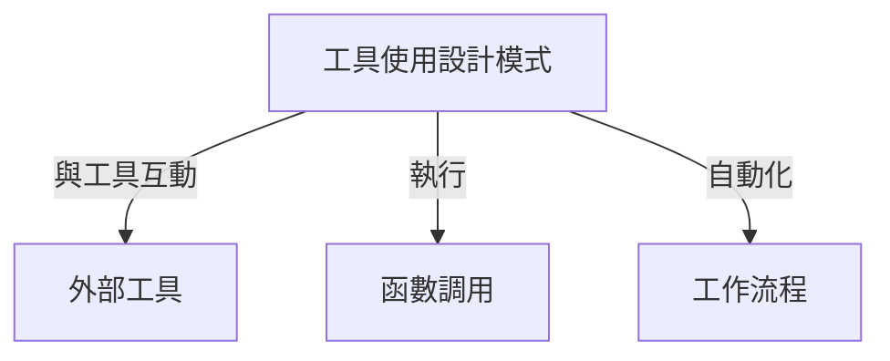
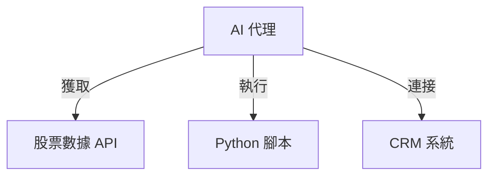
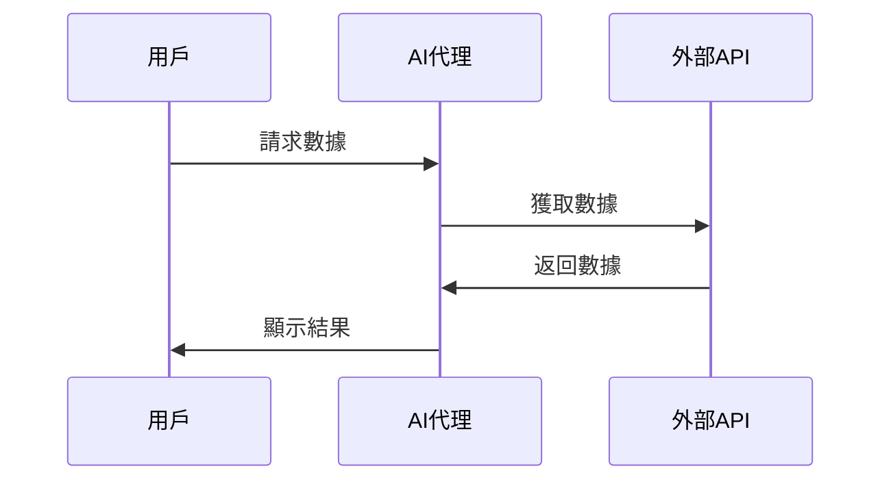

# 🔧 工具使用設計模式

## 📌 介紹
**工具使用設計模式**（Tool Use Design Pattern）擴展 AI 代理（Agent）嘅能力，令其可以調用 **外部工具**，執行 **函數調用**，以及處理 **複雜操作**，從而達成特定目標。

### 🏗 **核心組件**


| 🏗 **組件** | 🔍 **描述** |
|------------|------------|
| **函數調用** | 允許 AI 代理動態執行工具或 API。 |
| **外部 API** | 獲取即時數據（如股價、天氣）。 |
| **工作流自動化** | 自動執行多步驟任務（如報告生成）。 |

---

## 🛠 **應用場景**
使用呢個設計模式，AI 代理可以處理多種任務：

- **📡 即時數據獲取** – 連接 API 及數據庫，獲取即時資訊（如股價、天氣）。
- **🔢 代碼執行** – 運行 Python 腳本來解決問題。
- **📝 內容生成** – 文法檢查、摘要生成、內容編輯。
- **🤖 客戶支援** – 連接 CRM 及票務系統，回應客戶查詢。
- **🔄 自動化工作流** – 安排日程、發送郵件、管理任務。



---

## 🔧 **構建工具使用設計模式**
要實現工具使用設計模式，AI 代理需要：

1️⃣ **函數調用** – LLM 透過函數描述來選擇執行的功能。  
2️⃣ **API 訪問** – 代理與外部數據源連接以獲取資訊。  
3️⃣ **安全執行** – 確保代碼及 SQL 查詢執行安全。  



---

## 🔍 **示例：獲取城市當前時間**
### 1️⃣ **定義函數描述**
```python
tools = [
    {
        "type": "function",
        "function": {
            "name": "get_current_time",
            "description": "獲取特定城市的當前時間",
            "parameters": {
                "type": "object",
                "properties": {
                    "location": {
                        "type": "string",
                        "description": "城市名稱，例如：舊金山",
                    },
                },
                "required": ["location"],
            },
        }
    }
]
```

### 2️⃣ **實現函數執行**
```python
def get_current_time(location):
    """獲取當前時間"""
    current_time = datetime.now().strftime("%I:%M %p")
    return {"地點": location, "當前時間": current_time}
```

### 3️⃣ **處理 AI 代理函數調用**
```python
if response_message.tool_calls:
    for tool_call in response_message.tool_calls:
        if tool_call.function.name == "get_current_time":
            function_args = json.loads(tool_call.function.arguments)
            time_response = get_current_time(location=function_args.get("location"))
            print(time_response)
```

```bash
舊金山當前時間為 09:24 AM。
```

---

## 🔐 **安全考慮**
- **SQL 注入保護** – 設置數據庫為 **唯讀模式** 來防止惡意 SQL 操作。
- **受控執行** – 限制 AI 代理對系統關鍵功能的訪問權限。
- **數據隱私** – 限制工具對敏感數據的存取，保護用戶隱私。

---

## 🏗 **支援工具使用設計模式嘅 AI 框架**
許多 **Agentic Frameworks（代理框架）** 幫助簡化函數調用和工具整合：

### 🛠 **Semantic Kernel**
- 提供 **內置插件** 來支援 AI 代理。
- 支援 **自動函數序列化**，簡化函數調用過程。

```python
from semantic_kernel.functions import kernel_function

class GetCurrentTimePlugin:
    @kernel_function(description="獲取特定地點當前時間")
    def get_current_time(location: str = ""):
        ...
```

### ☁ **Azure AI Agent Service**
- **企業級 AI 代理部署平台**，適用於大規模應用場景。
- 內建 **Bing Search、Azure AI Search、Function Calling** 等多種工具。

```python
from azure.ai.projects import AIProjectClient
from azure.identity import DefaultAzureCredential
project_client = AIProjectClient.from_connection_string(credential=DefaultAzureCredential())
```

---

## 📚 **額外資源**
- [Azure AI Agent Service Workshop](https://microsoft.github.io/build-your-first-agent-with-azure-ai-agent-service-workshop/)
- [Semantic Kernel 函數調用指南](https://learn.microsoft.com/semantic-kernel/concepts/ai-services/chat-completion/function-calling/)
- [Autogen 工具集](https://microsoft.github.io/autogen/dev/user-guide/core-user-guide/components/tools.html)