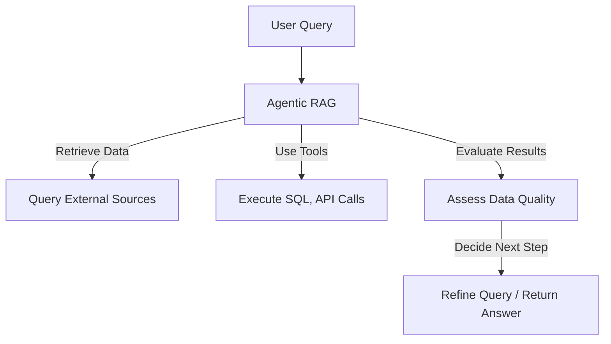
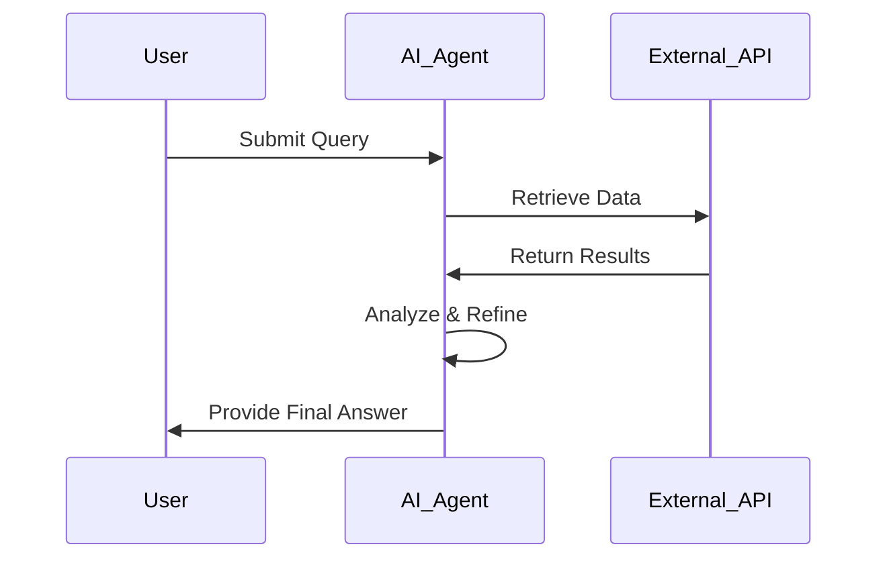
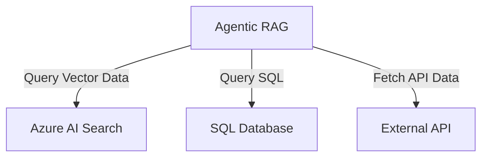
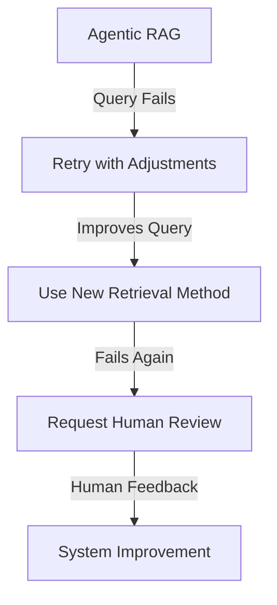
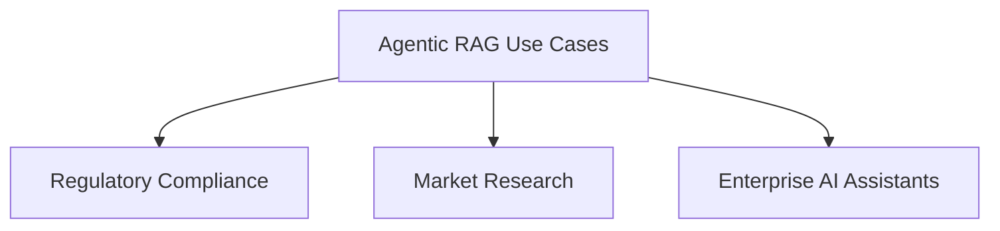
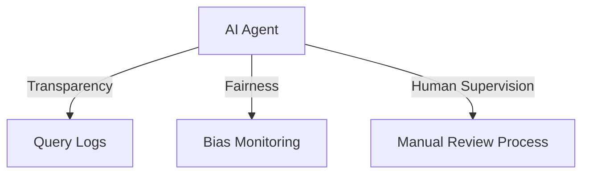

# 🤖 Agentic RAG

## 📌 Introduction
Agentic RAG (Agentic Retrieval-Augmented Generation) is an AI paradigm where **large language models (LLMs)** autonomously plan their next steps while retrieving information from external sources.  
Unlike static **retrieval-then-read** patterns, Agentic RAG involves **iterative calls** to the LLM, integrating **tool use**, **function calls**, and **structured outputs**.  
This allows the system to **refine queries, evaluate results, invoke additional tools, and iterate** until achieving an optimal answer.

## 🎯 Learning Goals
By the end of this lesson, you will understand:

- **What is Agentic RAG?** – Learn how LLMs autonomously plan and retrieve information dynamically.
- **Iterative Maker-Checker Loops** – Understand how LLMs refine queries, integrate tools, and evaluate outputs in cycles.
- **Owning the Reasoning Process** – Explore how AI agents independently determine problem-solving steps.
- **Agentic Workflow** – Study how an AI agent retrieves market trends, analyzes competitor data, and synthesizes insights.
- **Handling Failure and Self-Correction** – Learn how AI models refine searches and correct errors dynamically.
- **Use Cases & Value** – Identify areas where Agentic RAG is beneficial, such as compliance verification and database interactions.
- **Governance & Trust** – Understand the role of explainability, bias control, and human oversight in AI systems.

---

## 🔎 **What is Agentic RAG?**
Agentic RAG is an AI system where LLMs:
1. **Autonomously plan** next steps.
2. **Retrieve external information** using APIs, databases, and vector search.
3. **Refine queries iteratively** based on results.
4. **Use tools and functions** to interact with structured and unstructured data.

| 🏗 **Feature**  | 📝 **Description** |
|---------------|------------------|
| **Iterative Querying** | Refines searches dynamically for improved accuracy. |
| **Tool Integration** | Uses APIs, SQL, and vector search to retrieve data. |
| **Self-Improvement** | Adjusts strategies based on data quality. |

---

## 🔄 **Agentic RAG Workflow**
### 1️⃣ **Query Execution** – AI agent interprets the request.
### 2️⃣ **Data Retrieval** – Searches databases, APIs, or external sources.
### 3️⃣ **Evaluation & Refinement** – Assesses retrieved data; refines search if needed.
### 4️⃣ **Final Answer Generation** – Compiles insights into a structured response.

---

## 🛠 **Tools & Memory in Agentic RAG**
### 📚 **Data Sources**
| 🔍 **Retrieval Method** | 📌 **Description** |
|-----------------|------------------|
| **Vector Search** | Finds relevant text from PDFs, articles, or transcripts. |
| **SQL Queries** | Fetches structured business and financial data. |
| **API Calls** | Accesses real-time data like stock prices and news. |

---

## 🔧 **Handling Errors & Self-Correction**
When queries fail, the system:
1. **🔄 Retries with Improved Queries**
2. **🔍 Uses Debugging Tools**
3. **👤 Requests Human Oversight for Critical Tasks**

---

## ⚡ **Agentic RAG Use Cases**
1️⃣ **Legal & Compliance Analysis** – Ensures fact-checking and policy compliance.  
2️⃣ **Data-Intensive Research** – Automates queries for financial and market analysis.  
3️⃣ **Enterprise Knowledge Management** – Retrieves internal reports and documents.  

---

## 🔍 **Governance & Trust**
AI agents must follow:
- **📖 Explainable AI** – Maintain a record of queries and data sources.
- **🛡 Bias & Fairness** – Ensure diverse, unbiased retrieval strategies.
- **👥 Human Oversight** – Keep humans involved in critical decisions.

---

## 📚 **Further Reading**
- [Agentic RAG Guide](https://ragaboutit.com)
- [Azure AI RAG Tutorial](https://learn.microsoft.com/training/modules/use-own-data-azure-openai)
- [Building Agentic AI Systems](https://www.youtube.com/watch?v=AOSjiXP1jmQ)