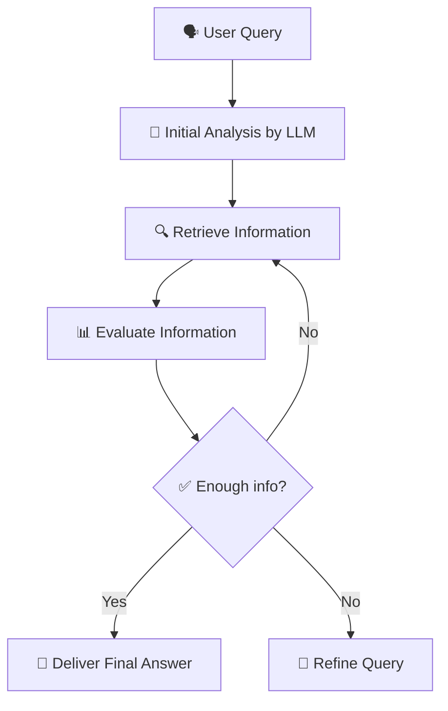
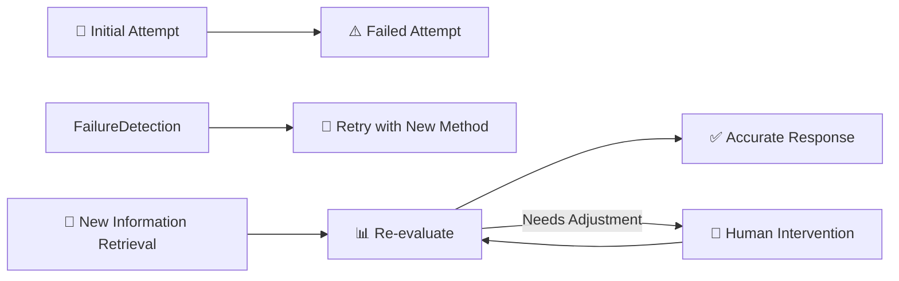
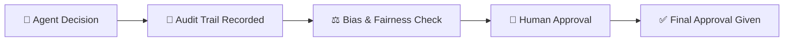

# 🧠 Agentic Retrieval-Augmented Generation (Agentic RAG) Explained Simply

---

## 📌 **What is Agentic RAG?**

Agentic RAG is a method where AI agents autonomously plan their actions by continuously interacting with external information sources until a high-quality answer is achieved.

Unlike traditional methods that follow a fixed path, Agentic RAG:
- 🔄 Continuously adjusts its strategy
- 🔎 Retrieves relevant external information dynamically
- ⚙️ Iteratively refines answers until satisfied

---

## 🎯 **Why Agentic RAG is Important**

| Importance | Explanation | Example |
|---|---|---|
| 🎯 **Accuracy** | Iteratively refines answers to increase correctness | Verifying legal information multiple times |
| 🔄 **Adaptability** | Can adjust strategy mid-task | Adjust queries when initial data is insufficient |
| ⚙️ **Autonomy** | Decides its own reasoning steps | Chooses best retrieval methods automatically |
| 📚 **Robustness** | Handles complex tasks gracefully | Combines multiple tools to provide comprehensive answers |

---

## 📌 **How Agentic RAG Works (Workflow)**

Agentic RAG follows a looped iterative workflow:

1. **Initial Query:** User asks a question or sets a goal.
2. **Information Retrieval:** Agent identifies gaps and chooses tools to fetch more information.
3. **Evaluation & Refinement:** Agent evaluates retrieved data and refines the query if needed.
4. **Iterative Process:** Repeats steps 2-3 until achieving a satisfactory answer.
5. **Final Response:** Presents a well-supported, accurate answer.

### 📌 **Visual Example of Workflow:**

---

## 🛠️ **Key Tools Used in Agentic RAG**

Agentic RAG integrates various tools:

| Tool Type | Usage | Example |
|-----------|-------|---------|
| 🌐 **Vector Search** | Finding relevant documents | Azure AI Search |
| 🗃️ **SQL Database** | Analyzing structured data | Azure SQL Database |
| 📡 **APIs** | Accessing real-time information | Custom APIs or external services |
| 🤖 **Language Models** | Synthesizing and summarizing findings | Azure OpenAI Service |

---

## ⚙️ **Agentic RAG’s Self-Correction Mechanisms**

Agentic systems dynamically correct and learn from errors:

| Mechanism | Explanation | Example |
|-----------|-------------|---------|
| 🔄 **Iterate & Re-query** | Retry with different approaches if initial attempt fails | Rewriting a faulty database query |
| 🛠️ **Diagnostic Tools** | Identify and fix problems dynamically | Debugging queries with specialized tools |
| 🙋 **Human Oversight** | Human intervention when AI reaches limitations | Humans approve complex decisions |

### 📌 **Visual Example of Self-Correction:**

---

## 🚧 **Boundaries of Agentic RAG**

Agentic RAG has clear limitations:

| Limitations | Explanation | Example |
|-------------|-------------|---------|
| 🎯 **Domain-specific** | Best within known data and contexts | Specialized medical or legal domains |
| 🖥️ **Infrastructure Dependent** | Requires robust backend infrastructure | Needs reliable databases and APIs |
| 🔒 **Respect Guardrails** | Must respect predefined ethical and practical boundaries | Cannot autonomously expand beyond set tasks |

---

## 📚 **Practical Use Cases for Agentic RAG**

Agentic RAG is effective in situations demanding precision and iterative refinement:

| Scenario | Explanation | Example |
|----------|-------------|---------|
| ✅ **Correctness-critical** | Accurate and thorough data validation | Regulatory compliance checks |
| 🗃️ **Complex Databases** | Queries requiring multiple refinements | Advanced financial data retrieval |
| 🔄 **Extended Workflows** | Tasks evolving with new information | Ongoing market strategy updates |

---

## 🔍 **Transparency, Governance & Trust**

Agentic RAG emphasizes responsible use through:

| Principle | Importance | Example |
|-----------|------------|---------|
| 🧾 **Explainable Reasoning** | Transparent processes | Detailed logs of AI decision-making |
| ⚖️ **Bias Control** | Fair and balanced data retrieval | Regular audits for biases |
| 🙋 **Human Oversight** | Humans monitor sensitive decisions | Final approval by experts |

### 📌 **Transparency Workflow Example:**

---

## 🌟 **Summary & Key Points**

- **Agentic RAG** continuously retrieves and refines information autonomously.
- Its iterative nature ensures high accuracy and adaptability.
- Integrates multiple tools for comprehensive problem-solving.
- Robust self-correction ensures ongoing improvement and reliability.
- Governed by strict ethical guidelines and transparency for trustworthiness.

---

## 📖 **Additional Resources**

- [Microsoft Learn - RAG with Azure](https://learn.microsoft.com/training/modules/use-own-data-azure-openai)
- [What is Agentic RAG? (Weaviate)](https://weaviate.io/blog/what-is-agentic-rag)
- [Agentic RAG: Complete Guide](https://ragaboutit.com/agentic-rag-a-complete-guide-to-agent-based-retrieval-augmented-generation/)
- [Agentic RAG on Hugging Face](https://huggingface.co/learn/cookbook/agent_rag)