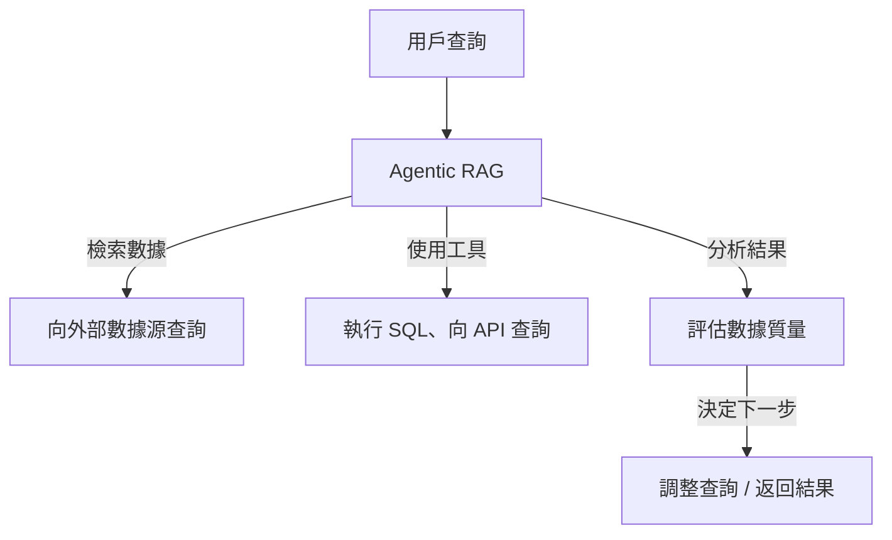
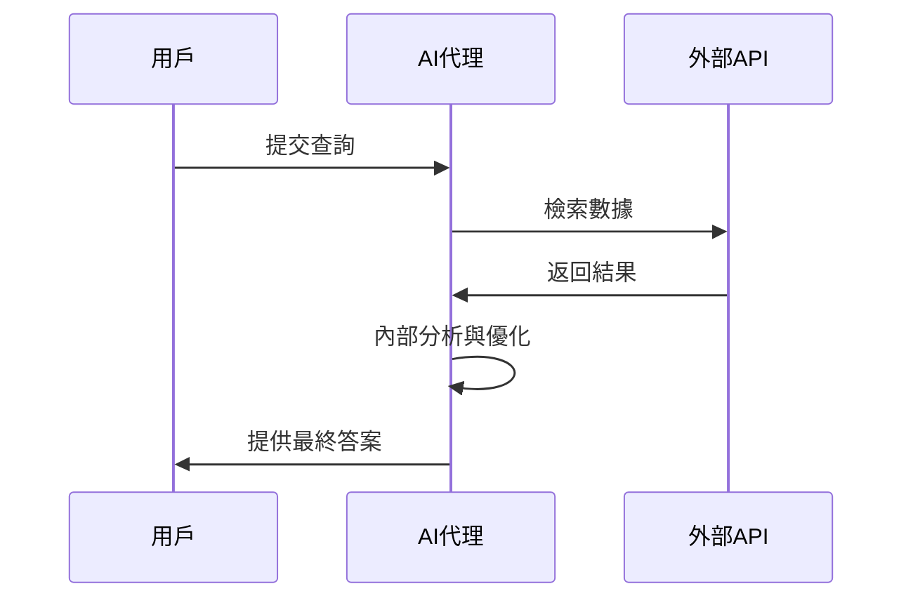
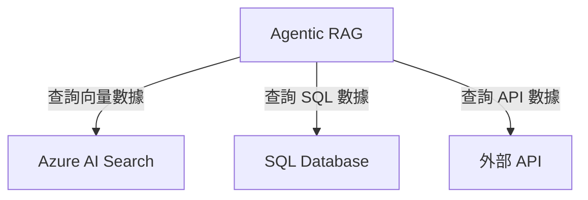
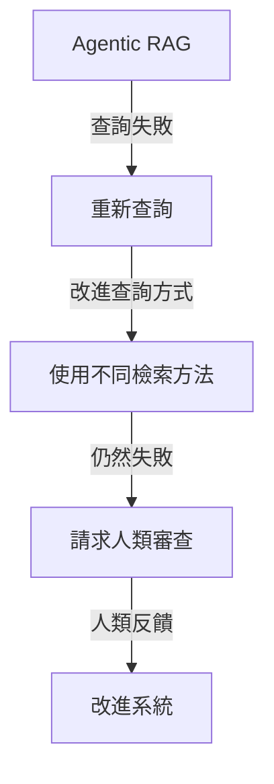
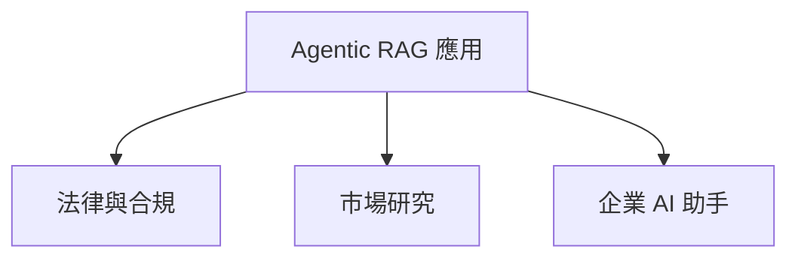
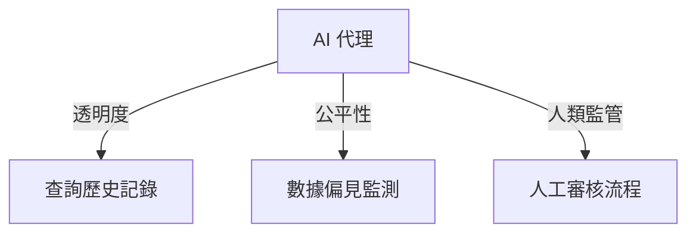

# 🤖 Agentic RAG（智能代理檢索增強生成）

## 📌 介紹
Agentic RAG（智能代理檢索增強生成）係一種 AI 模型，透過**大型語言模型（LLMs）**來**自主規劃下一步**，並從外部數據源檢索資訊。  
唔同於傳統**檢索-閱讀**模式，Agentic RAG 透過**多次迭代**，結合**工具調用**、**函數調用**及**結構化輸出**，確保結果準確、查詢完善，並且可以自動修正錯誤。

## 🎯 學習目標
完成呢個課程後，你將學到：
- **Agentic RAG 係咩？** – 了解 LLM 點樣自主計劃，動態檢索數據。
- **迭代 Maker-Checker 模式** – 學習 AI 代理如何優化查詢，整合工具，並評估輸出。
- **自主推理流程** – AI 代理點樣自行決定解決問題嘅步驟。
- **Agentic 工作流** – 研究 AI 代理如何檢索市場趨勢、分析競爭對手數據，並綜合見解。
- **處理錯誤與自我修正** – 學習 AI 模型點樣改進搜索、修正錯誤。
- **應用場景與價值** – 瞭解 Agentic RAG 嘅應用，例如合規審查、數據庫交互等。
- **治理與信任** – 學習 AI 系統如何確保透明度、公平性及人類監督。

---

## 🔎 **Agentic RAG 係咩？**
Agentic RAG 係一種 AI 系統，LLMs 會：
1. **自主計劃** 下一步動作。
2. **檢索外部資訊**，包括 API、數據庫、向量搜索等。
3. **迭代優化查詢**，根據結果改進搜索策略。
4. **使用工具與函數**，處理結構化及非結構化數據。

| 🏗 **特點**  | 📝 **描述** |
|------------|-----------|
| **迭代查詢** | 根據回饋動態優化搜索，提高準確度。 |
| **工具整合** | 透過 API、SQL、向量搜索獲取數據。 |
| **自我改進** | 根據數據質量調整策略，提高結果可靠性。 |

---

## 🔄 **Agentic RAG 工作流程**
### 1️⃣ **查詢執行** – AI 代理解讀用戶請求。
### 2️⃣ **數據檢索** – 搜索數據庫、API 或外部來源。
### 3️⃣ **評估與優化** – 分析數據，必要時改進查詢方式。
### 4️⃣ **生成最終答案** – 綜合數據並提供結構化輸出。

---

## 🛠 **工具與記憶機制**
### 📚 **數據檢索方法**
| 🔍 **檢索方式**  | 📌 **描述** |
|--------------|------------------|
| **向量搜索** | 用於非結構化數據，例如 PDF、文章、演講稿。 |
| **SQL 查詢** | 搜索結構化數據，如客戶資訊、財務報告。 |
| **API 數據** | 通過 API 獲取即時資訊，例如股票價格、新聞數據。 |

---

## 🔧 **錯誤處理與自我修正**
當系統遇到錯誤或獲取資訊不足時，會：
1. **🔄 重新查詢，優化搜索**
2. **🔍 使用診斷工具檢查錯誤**
3. **👤 在高風險決策下請求人類監督**

---

## ⚡ **Agentic RAG 應用場景**
1️⃣ **法律與合規分析** – 用於法規檢查與事實核對。  
2️⃣ **數據密集型研究** – 自動執行財務及市場數據查詢。  
3️⃣ **企業知識管理** – 檢索內部報告與文件，提高信息獲取效率。  

---

## 🔍 **治理與信任**
確保 AI 代理透明可信，需要：
- **📖 可解釋性** – 代理記錄查詢歷史，顯示數據來源。
- **🛡 偏見監控** – 優化檢索策略，確保數據公平性。
- **👤 人類監督** – 在關鍵決策時提供人工審查機制。

---

## 📚 **進一步學習**
- [Agentic RAG 詳細指南](https://ragaboutit.com/agentic-rag-a-complete-guide-to-agent-based-retrieval-augmented-generation/)
- [Azure AI RAG 教程](https://learn.microsoft.com/training/modules/use-own-data-azure-openai)
- [如何構建 Agentic AI 系統](https://www.youtube.com/watch?v=AOSjiXP1jmQ)

---

## 🏁 **總結**
Agentic RAG 係 AI 檢索增強生成技術嘅自然進化，透過迭代學習、自主檢索、工具調用等方式，提高準確度同決策能力。  
雖然仍需依賴人類設定規則，但佢為企業及研究機構提供咗更靈活、高效嘅 AI 解決方案。