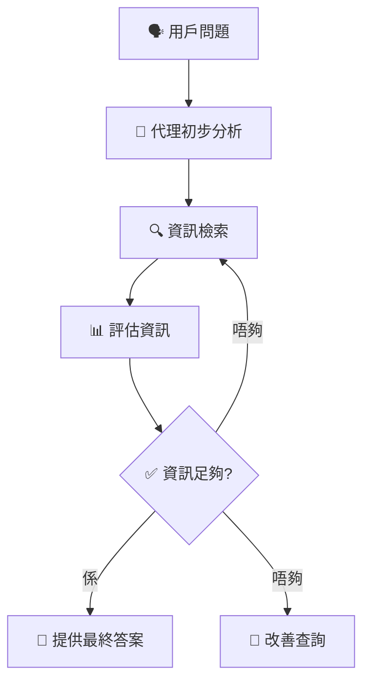
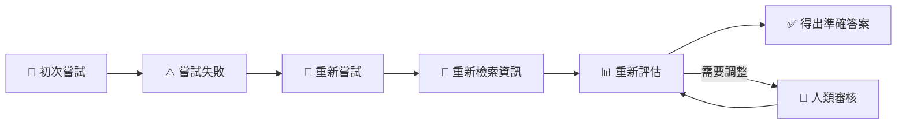
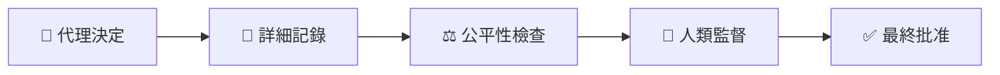

# 🧠 Agentic RAG（智能代理檢索增強生成）簡單易明版

---

## 📌 **咩係 Agentic RAG？**

Agentic RAG（智能代理檢索增強生成）係一種AI方法，智能代理能夠自主地規劃自己嘅行動，不斷從外部獲取資訊，直到得出滿意嘅結果為止。

相比傳統固定方式，Agentic RAG 特點係：
- 🔄 持續調整策略
- 🔎 自動獲取相關外部資訊
- ⚙️ 反覆精煉答案，直至滿意為止

---

## 🎯 **Agentic RAG 點解重要？**

| 優點 | 解釋 | 例子 |
|---|---|---|
| 🎯 **準確性** | 反覆改善答案，提升正確度 | 法律資訊重複核實 |
| 🔄 **靈活性** | 能夠中途調整策略 | 資料不足時即時改變查詢方法 |
| ⚙️ **自主性** | 自主決定步驟 | 自動選擇最好嘅資訊檢索方式 |
| 📚 **穩健性** | 能夠處理複雜任務 | 結合多種工具全面分析 |

---

## 📌 **Agentic RAG 嘅運作模式（流程）**

Agentic RAG 採用迴圈式反覆運作模式：

1. **初步查詢**：用戶提出問題或目標。
2. **資訊檢索**：代理識別資訊缺口，自動選擇合適工具獲取資料。
3. **評估同精煉**：代理評估資訊，不足就調整查詢。
4. **反覆執行**：重複步驟2-3直到取得滿意嘅結果。
5. **提供答案**：呈現經過驗證嘅最終答案。

### 📌 **視覺化流程圖：**

---

## 🛠️ **Agentic RAG 主要使用工具**

Agentic RAG 會用到嘅工具：

| 工具類型 | 用途 | 例子 |
|-----------|-------|---------|
| 🌐 **向量搜尋** | 查找相關文件 | Azure AI Search |
| 🗃️ **SQL數據庫** | 處理結構化數據 | Azure SQL Database |
| 📡 **API接口** | 存取即時資訊 | 定制API |
| 🤖 **語言模型** | 資訊整合與總結 | Azure OpenAI Service |

---

## ⚙️ **Agentic RAG 嘅自我修正機制**

智能代理能自動識別並修正錯誤：

| 機制 | 解釋 | 例子 |
|-----------|-------------|---------|
| 🔄 **重新查詢** | 初次失敗後自動再試 | 重寫錯誤嘅數據庫查詢 |
| 🛠️ **診斷工具** | 自動發現及修正問題 | 用專業工具偵錯 |
| 🙋 **人類干預** | AI無法解決時請求人類協助 | 人類審核敏感決策 |

### 📌 **自我修正流程圖示例：**

---

## 🚧 **Agentic RAG 嘅能力界限**

Agentic RAG 有一定限制：

| 限制 | 解釋 | 例子 |
|-------------|-------------|---------|
| 🎯 **領域專屬性** | 只適合特定領域內運作 | 醫療或法律專業 |
| 🖥️ **基礎設施依賴** | 依賴後端系統 | 需穩定嘅數據庫同API |
| 🔒 **遵守規範** | 必須遵守既定倫理標準 | 不能自行超出設定範圍 |

---

## 📚 **Agentic RAG 實際應用情境**

Agentic RAG 喺以下場景特別有效：

| 場景 | 解釋 | 例子 |
|----------|-------------|---------|
| ✅ **準確性高要求** | 需要準確無誤嘅資訊核實 | 法規遵守檢查 |
| 🗃️ **複雜數據查詢** | 須多次調整查詢嘅數據庫檢索 | 財務數據分析 |
| 🔄 **長期運作任務** | 不斷更新資訊嘅持續任務 | 市場策略更新 |

---

## 🔍 **透明度、管治同信任**

Agentic RAG 強調負責任使用：

| 原則 | 重要性 | 例子 |
|-----------|------------|---------|
| 🧾 **解釋性推理** | 提供決策過程清晰紀錄 | 詳細記錄代理決策過程 |
| ⚖️ **控制偏見** | 確保資訊平衡公平 | 定期審核結果 |
| 🙋 **人類監督** | 人類監控敏感決策 | 專家最終批核 |

### 📌 **透明度流程圖示例：**

---

## 🌟 **重點總結**

- **Agentic RAG** 自主檢索、反覆精煉資訊。
- 高度自主、準確且靈活。
- 整合多種工具，解決複雜問題。
- 強大的自我修正能力，持續提高準確性。
- 嚴格遵守倫理規範，保持高度透明度同信任。

---

## 📖 **更多參考資料**

- [Microsoft Learn - Azure RAG 實踐指南](https://learn.microsoft.com/training/modules/use-own-data-azure-openai)
- [Weaviate 介紹 Agentic RAG](https://weaviate.io/blog/what-is-agentic-rag)
- [Agentic RAG 完整指南](https://ragaboutit.com/agentic-rag-a-complete-guide-to-agent-based-retrieval-augmented-generation/)
- [Hugging Face - Agentic RAG 教學](https://huggingface.co/learn/cookbook/agent_rag)