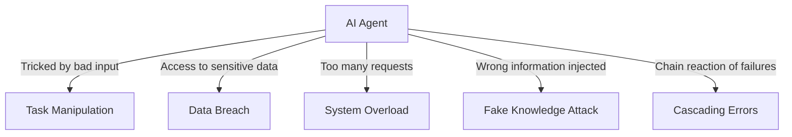
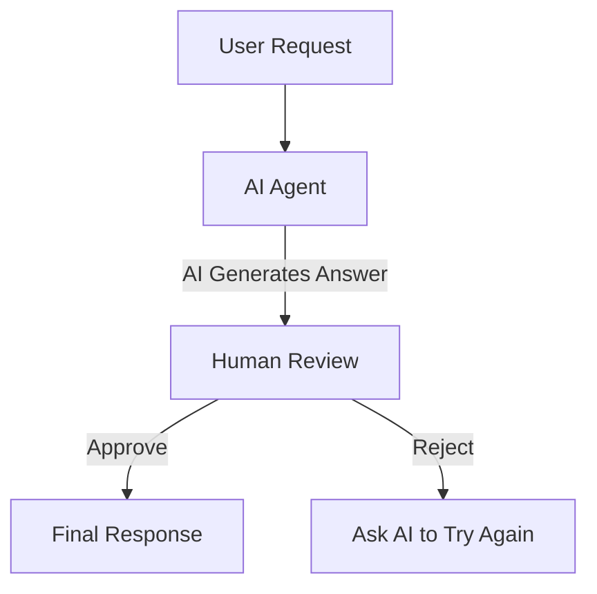

# 🤖 Building Trustworthy AI Agents – A Simple Guide

## 📌 Introduction
AI agents are smart programs that can **think, learn, and act** on their own. But how do we make sure they are **safe, secure, and trustworthy**?  

This guide will explain:
- How to **build and deploy** AI agents responsibly.
- The **security risks** AI agents face and how to prevent them.
- How to **protect user privacy** while developing AI agents.

---

## 🎯 Learning Goals
After reading this, you will learn:
✅ How to **identify risks** when creating AI agents.  
✅ Ways to **secure AI agents** from attacks.  
✅ How to **protect user data** and create a **better user experience**.  

---

## 🦺 Safety – Making AI Agents Reliable
An AI agent should always work as expected.  
To ensure this, developers follow a **System Message Framework** to **train AI agents** with clear instructions.

### 🔹 What is a System Message?
A **system message** is a **set of rules and instructions** that tell the AI **what to do** and **how to respond**.  
For example, an AI **travel assistant** might have a system message like this:

```plaintext
You are a travel assistant for Contoso Travel.
Your job is to help customers book flights.
You can search flights, book tickets, and send travel alerts.
```

This **ensures** the AI agent **stays on track** and does not go off-topic.

---

## 🔐 Understanding AI Threats
AI agents face **various attacks** that can make them unsafe.  
Here are some **common threats** and how to **stop them**:



| 🚨 **Threat** | 🛡 **Prevention** |
|-------------|----------------|
| **Task Manipulation** (Tricking AI into wrong actions) | Add input validation and set clear task limits. |
| **Data Breach** (Hacking AI to access private info) | Restrict access and use secure communication. |
| **System Overload** (Too many requests crash the system) | Limit AI requests and set usage policies. |
| **Fake Knowledge Attack** (Feeding AI false info) | Regularly check and verify AI knowledge sources. |
| **Cascading Errors** (One failure causes many failures) | Use backup plans and safety checks. |

---

## 👥 **Human-in-the-Loop – Keeping AI Accountable**
Instead of letting AI agents **run without supervision**, we can use a **Human-in-the-Loop** system.  
This means that **humans can review, approve, or reject AI actions**.



✅ This approach ensures **accuracy** and prevents **bad decisions**.

---

## 🛠 **Example: AI-Assisted Poem Writing**
Here is a **Python script** that shows how a **Human-in-the-Loop system** works:

```python
# Import AI model
model_client = OpenAIChatCompletionClient(model="gpt-4o-mini")

# Create AI assistant
assistant = AssistantAgent("assistant", model_client=model_client)

# Human user input
user_proxy = UserProxyAgent("user_proxy", input_func=input)

# Set termination condition (User says "APPROVE" to finish)
termination = TextMentionTermination("APPROVE")

# AI + Human teamwork
team = RoundRobinGroupChat([assistant, user_proxy], termination_condition=termination)

# Run the system
stream = team.run_stream(task="Write a 4-line poem about the ocean.")
await Console(stream)
```

### 🔹 **How it Works**
- The AI **writes a short poem**.  
- A **human reads it** and decides to approve or request a revision.  
- The AI **refines the poem** if needed.  

This method **prevents errors** and makes AI **more reliable**.

---

## 🔎 **Conclusion**
To build **trustworthy AI agents**, we must:
✅ Use **structured system messages** to keep AI on track.  
✅ **Identify and stop threats** before they cause damage.  
✅ Implement **security measures** like access control and validation.  
✅ Keep **humans in the loop** for important decisions.  

By following these steps, developers can create AI agents that are **safe, useful, and ethical**.  

---

## 📚 **Further Reading**
- [Responsible AI Overview](https://learn.microsoft.com/azure/ai-studio/responsible-use-of-ai-overview)  
- [Generative AI Model Evaluation](https://learn.microsoft.com/azure/ai-studio/concepts/evaluation-approach-gen-ai)  
- [AI Safety System Messages](https://learn.microsoft.com/azure/ai-services/openai/concepts/system-message)  
- [AI Risk Assessment Template](https://blogs.microsoft.com/wp-content/uploads/prod/sites/5/2022/06/Microsoft-RAI-Impact-Assessment-Template.pdf)  