# 🛡️ Building Trustworthy AI Agents Explained Simply

---

## 📌 **Introduction to Trustworthy AI Agents**

Building **Trustworthy AI Agents** means creating AI systems that are safe, secure, and protect user privacy.

---

## 🎯 **Importance of Trustworthy AI Agents**

| Importance | Explanation | Example |
|---|---|---|
| ✅ **Safety** | Ensuring agents perform as intended without causing harm | Booking flights accurately without errors |
| 🔐 **Security** | Protecting AI systems and data from unauthorized access | Preventing hackers from manipulating flight bookings |
| 🕵️ **Privacy** | Keeping user data confidential and secure | Ensuring personal details aren't leaked |

---

## 🧱 **Steps to Create Trustworthy AI Agents**

### 📝 **System Message Framework**

This helps AI agents clearly understand their roles through structured instructions.

#### 📌 **Framework Steps:**

| Step | Explanation | Example |
|------|-------------|---------|
| 1️⃣ **Create Meta System Message** | General template used to create specific agent prompts | "You are an expert at creating AI assistants..." |
| 2️⃣ **Basic Agent Prompt** | Clearly defines agent's role and tasks | "You are a travel agent who books flights..." |
| 3️⃣ **Optimize Prompt via LLM** | Improve basic prompt with more details for clarity | Clearly outline responsibilities, objectives, and style |
| 4️⃣ **Iterate and Improve** | Continuously refine system prompts based on feedback | Adjust messages based on user interactions |

### 📌 **Visual Framework Example:**

```mermaid
graph TD;
MetaPrompt[🗒️ Meta System Message] --> BasicPrompt[✏️ Basic Agent Prompt];
BasicPrompt --> LLM[🤖 LLM Optimization];
LLM --> OptimizedPrompt[📑 Optimized System Prompt];
OptimizedPrompt --> Iterate[🔄 Iteration & Improvement];
Iterate --> BasicPrompt;
```

---

## 🚨 **Understanding Security Threats**

Security threats that AI agents face and ways to mitigate them:

| Threat Type | Description | Mitigation |
|---|---|---|
| 📍 **Task & Instruction Manipulation** | Attackers try to alter agent instructions | Validate inputs, limit interactions |
| 🔑 **Access to Critical Systems** | Unauthorized access to sensitive data through agents | Implement strict access control |
| 📛 **Resource & Service Overloading** | Agents used to overwhelm services | Limit requests per agent |
| 🗂️ **Knowledge Base Poisoning** | Corruption of data that agents rely on | Regular data checks and secure access |
| ⚠️ **Cascading Errors** | Errors in one part spreading across systems | Isolate agents, implement error handling |

### 📌 **Threat Mitigation Flow:**

```mermaid
graph TD;
UserInput[🗣️ User Input] --> Validation[✅ Input Validation];
Validation --> AgentTask[🤖 Agent Task];
AgentTask --> CriticalSystems[🔐 Secure Access to Systems];
AgentTask --> Resources[📌 Limit Resource Use];
AgentTask --> KnowledgeBase[📚 Validate Knowledge Base];
AgentTask --> ErrorHandling[⚙️ Error Handling];
```

---

## 🙋 **Human-in-the-Loop Approach**

Users actively participate to oversee and guide AI agents. This keeps agents aligned with human expectations.

| Benefit | Explanation | Example |
|---|---|---|
| 🗨️ **Real-time Feedback** | Humans give immediate feedback | User approves or revises a flight booking |
| 🔄 **Iterative Improvement** | Continuous refinement of agent outputs | Adjustments based on user corrections |

### 📌 **Human-in-the-Loop Example:**

```mermaid
graph LR;
AgentStarts[🤖 AI Agent Starts Task] --> HumanCheck[🙋 User Checks Task];
HumanCheck -- Approve --> AgentCompletes[✅ Task Approved & Completed];
HumanCheck -- Request Changes --> AgentAdjusts[🔄 Agent Revises Task];
AgentAdjusts --> HumanCheck;
```

---

## 📚 **Conclusion & Key Takeaways**

- Trustworthy AI agents require **clear guidelines**, **robust security**, and **privacy protection**.
- Systematic prompting frameworks help agents clearly understand their tasks.
- Regular threat analysis and mitigation strategies protect systems.
- Human-in-the-loop approaches ensure AI agents meet user expectations and remain secure.

---

## 🌟 **Additional Resources**

- [Responsible AI Overview](https://learn.microsoft.com/azure/ai-studio/responsible-use-of-ai-overview)
- [Evaluation of Generative AI](https://learn.microsoft.com/azure/ai-studio/concepts/evaluation-approach-gen-ai)
- [Safety System Messages](https://learn.microsoft.com/azure/ai-services/openai/concepts/system-message?context=%2Fazure%2Fai-studio%2Fcontext%2Fcontext&tabs=top-techniques)
- [Risk Assessment Template](https://blogs.microsoft.com/wp-content/uploads/prod/sites/5/2022/06/Microsoft-RAI-Impact-Assessment-Template.pdf?culture=en-us&country=us)