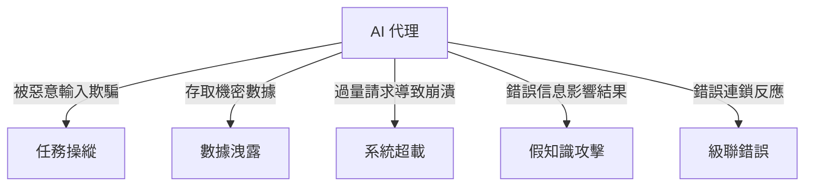
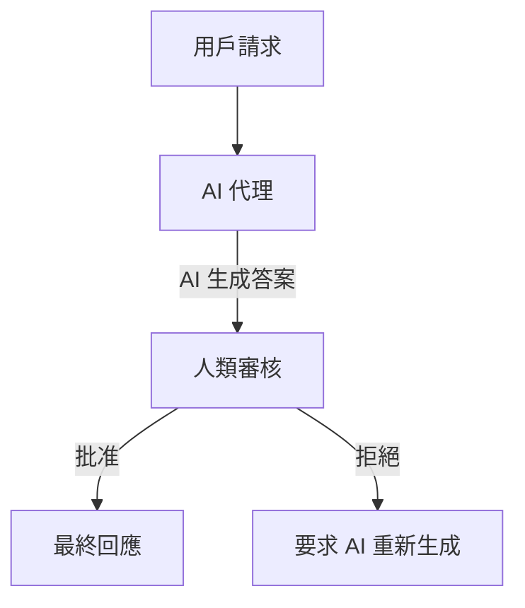

# 🤖 構建可信任的 AI 代理 – 簡單指南

## 📌 介紹
AI 代理（AI Agents）係**可以自主思考、學習同執行任務**嘅智能系統。但點樣確保佢哋**安全、可靠，唔會出錯**呢？  

呢篇指南會解釋：
- **點樣負責任地開發 AI 代理**  
- AI 代理會面對嘅 **安全風險** 及如何防範  
- **點樣保護用戶私隱**，確保 AI 代理既有用又安全  

---

## 🎯 學習目標
讀完呢篇指南後，你會學識：
✅ **識別 AI 代理開發風險**  
✅ **保護 AI 免受攻擊**  
✅ **保障用戶數據，提供更佳體驗**  

---

## 🦺 安全性 – 確保 AI 可靠
一個可信任嘅 AI 代理應該**永遠按照預期運作**。  
為咗確保呢點，開發人員會用 **系統消息框架** 來**訓練 AI 代理**，設定清晰指令。

### 🔹 乜嘢係系統消息（System Message）？
**系統消息** 係一組 **規則與指示**，話俾 AI 知 **佢應該做啲咩**，點樣回應用戶。  
例如，一個**旅遊助手 AI** 可能會有以下指令：

```plaintext
你係 Contoso Travel 嘅旅遊助手。
你負責幫客戶預訂機票。
你可以搜尋航班、訂票，並發送旅遊提醒。
```

✅ 呢啲指令確保 AI **保持專注**，唔會講錯或做錯嘢。

---

## 🔐 理解 AI 風險
AI 代理可能會受到**各種攻擊**，導致錯誤或洩露數據。  
以下係幾種 **常見威脅** 及 **防範方法**：



| 🚨 **威脅** | 🛡 **防範方法** |
|-------------|----------------|
| **任務操縱**（欺騙 AI 執行錯誤指令） | 設置輸入驗證，限制 AI 代理任務範圍。 |
| **數據洩露**（黑客竊取敏感信息） | 設置存取權限，使用安全加密通信。 |
| **系統超載**（過多請求導致崩潰） | 限制 AI 請求速率，設定流量控制。 |
| **假知識攻擊**（向 AI 錯誤地餵入虛假信息） | 定期審查 AI 知識庫，驗證資訊來源。 |
| **級聯錯誤**（一個錯誤導致連鎖反應） | 設置備用方案及錯誤處理機制。 |

---

## 👥 **人機協作 – 讓 AI 受監管**
AI 代理**不應該完全自主運行**，應該有**人類監管（Human-in-the-Loop）**來確保準確性。  
這種方式讓**人類可以審核、批准或拒絕 AI 決策**。



✅ **這樣可以避免 AI 犯錯，確保可靠性！**

---

## 🛠 **示例：AI 協助寫詩**
以下 Python 代碼示範咗**人機協作審核系統**：

```python
# 引入 AI 模型
model_client = OpenAIChatCompletionClient(model="gpt-4o-mini")

# 建立 AI 助手
assistant = AssistantAgent("assistant", model_client=model_client)

# 用戶輸入
user_proxy = UserProxyAgent("user_proxy", input_func=input)

# 設置終止條件（用戶輸入 "APPROVE" 代表審核通過）
termination = TextMentionTermination("APPROVE")

# AI + 人類團隊合作
team = RoundRobinGroupChat([assistant, user_proxy], termination_condition=termination)

# 運行 AI
stream = team.run_stream(task="寫一首 4 句關於大海嘅詩。")
await Console(stream)
```

### 🔹 **點樣運作？**
1️⃣ **AI 代理先寫一首詩**  
2️⃣ **人類讀取內容，決定接受或要求修改**  
3️⃣ **AI 根據反饋進行優化**  

✅ 這樣可以防止 AI 產生不準確或不合適的內容。

---

## 🔎 **總結**
要構建 **可信任的 AI 代理**，開發者應該：
✅ **使用系統消息框架**，確保 AI 遵循規則。  
✅ **識別風險**，防範惡意攻擊和數據洩露。  
✅ **實施安全措施**，例如存取控制、數據驗證。  
✅ **保持人類監督**，在關鍵決策中加入人工審核。  

**透過以上方法，我哋可以開發出更安全、更可靠、更具道德標準的 AI 代理！**

---

## 📚 **進一步學習**
- [負責任 AI 概覽](https://learn.microsoft.com/azure/ai-studio/responsible-use-of-ai-overview)  
- [生成式 AI 模型評估](https://learn.microsoft.com/azure/ai-studio/concepts/evaluation-approach-gen-ai)  
- [AI 安全系統消息](https://learn.microsoft.com/azure/ai-services/openai/concepts/system-message)  
- [AI 風險評估模板](https://blogs.microsoft.com/wp-content/uploads/prod/sites/5/2022/06/Microsoft-RAI-Impact-Assessment-Template.pdf)  