# 📅 Planning Design for AI Agents Explained Simply

---

## 📌 **Introduction to Planning**

Planning is how an **AI Agent** clearly defines goals and breaks down complicated tasks into smaller, manageable parts.

**Example Goal:** "Plan a 3-day travel itinerary."

Clear planning ensures agents focus on the exact outcomes, such as flights, hotels, and activities.

---

## 🎯 **Why Planning Matters:**

| Benefit | Explanation | Example |
|---|---|---|
| 🎯 **Clear Goals** | Clearly defined outcomes lead to accurate results. | "Book flights and hotels in Melbourne." |
| 🧩 **Task Decomposition** | Complex tasks become simpler subtasks. | One agent books flights; another books hotels. |
| 🛠️ **Tools Integration** | Select and utilize correct tools at the right time. | Search tools, booking systems, data analytics. |
| 🔄 **Iterative Improvement** | Continually refine based on feedback. | Change itinerary based on user preferences. |

---

## 🧩 **Breaking Down Tasks (Subtasking)**

Tasks are easier to manage when separated into logical steps:

| Main Task | Subtasks | Specialized AI Agents |
|-----------|-----------|-----------------------|
| 🌎 **Plan Trip** | ✈️ Flights | Flight Booking Agent |
| 🏨 **Accommodation** | Hotel Booking Agent |
| 🚗 **Transport** | Car Rental Agent |
| 🎡 **Activities** | Activities Agent |

### 📌 **Visual Example of Task Breakdown:**

```mermaid
graph TD;
MainGoal[Plan Family Trip]-->Flights[✈️ Book Flights];
MainGoal-->Hotels[🏨 Book Hotels];
MainGoal-->Car[🚗 Arrange Car Rental];
MainGoal-->Activities[🎡 Suggest Activities];
MainGoal-->Info[📚 Provide Destination Info];
```



---

## 📑 **Structured Output**

Structured outputs (like JSON) make it easier for multiple agents to interpret and execute tasks automatically.

### 📌 **Example of Structured Planning Output:**
```json
{
  "main_task": "Plan family trip from Singapore to Melbourne.",
  "subtasks": [
    {"assigned_agent": "flight_booking", "task_details": "Book flights"},
    {"assigned_agent": "hotel_booking", "task_details": "Family-friendly hotels"},
    {"assigned_agent": "car_rental", "task_details": "Suitable car for 4"},
    {"assigned_agent": "activities_booking", "task_details": "Family activities"},
    {"assigned_agent": "destination_info", "task_details": "Info about Melbourne"}
  ]
}
```

### 📌 **Visual Representation of Structured Output Usage:**

```mermaid
graph LR;
User[🧑 User Request] --> Planner[🗂️ Planner Agent];
Planner --> FlightAgent[✈️ Flight Booking Agent];
Planner --> HotelAgent[🏨 Hotel Booking Agent];
Planner --> CarAgent[🚗 Car Rental Agent];
Planner --> ActivityAgent[🎡 Activities Agent];
Planner --> InfoAgent[📚 Destination Info Agent];
FlightAgent --> Results[✅ Results];
HotelAgent --> Results;
CarAgent --> Results;
ActivityAgent --> Results;
InfoAgent --> Results;
Results --> UserFeedback[🗣️ User Feedback];
UserFeedback --> Planner;
```



---

## 🚨 **Event-Driven & Iterative Planning**

In dynamic situations, agents must adapt quickly. This process is known as **iterative planning**, where each decision influences the next.

| Scenario | Action |
|---|---|
| ⚠️ **Unexpected Data** | Adjust booking method after encountering errors. |
| 🔄 **User Feedback** | Update itinerary when user prefers earlier flights. |

### 📌 **Iterative Planning Process:**

```mermaid
graph TD;
InitialPlan[📋 Initial Plan] --> ExecuteTask[🛠️ Execute Subtasks];
ExecuteTask --> CheckResults[📊 Evaluate Results];
CheckResults --> Feedback[🗣️ User Feedback / Errors];
Feedback --> Replan[🔄 Adjust & Replan];
Replan --> ExecuteTask;
CheckResults --> FinalOutput[🎉 Final Plan Delivered];
```


---

## 🛠️ **Agent Orchestration**

A coordinator (Planner) assigns tasks to specialized agents:

- **Semantic Routing**: Determines appropriate agents.
- **Delegation**: Tasks assigned to specialized agents.
- **Summary**: Results compiled clearly for the user.

### 📌 **Agent Orchestration Flow:**

```mermaid
graph LR;
UserRequest[🧑 User Request] --> SemanticRouter[🎯 Semantic Router];
SemanticRouter --> Planner[🗂️ Planner Agent];
Planner --> SpecializedAgents[🔧 Specialized Agents];
SpecializedAgents --> CompilationAgent[📌 Compilation Agent];
CompilationAgent --> User[🧑 Final Result Delivered];
```



---

## 📚 **Key Takeaways**

- Clearly defined goals simplify complex tasks.
- Structured outputs facilitate automation and agent coordination.
- Iterative planning adapts tasks dynamically based on feedback.
- Specialized agents handle specific tasks, coordinated by a planner agent.

---

## 🌟 **Additional Resources**

- [AutoGen Structured Output](https://microsoft.github.io/autogen/stable/user-guide/core-user-guide/cookbook/structured-output-agent.html)
- [Magnetic One - Multi-Agent System](https://www.microsoft.com/research/articles/magentic-one-a-generalist-multi-agent-system-for-solving-complex-tasks)