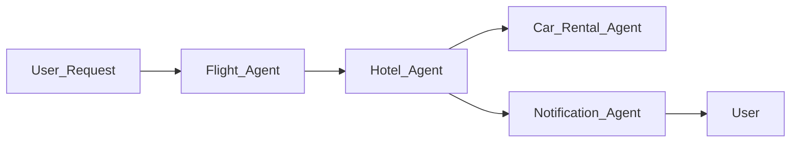
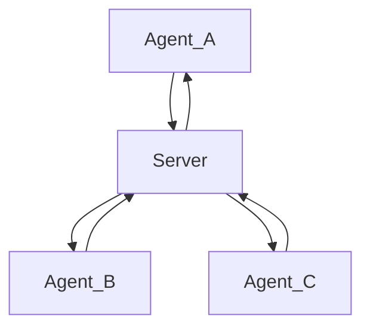
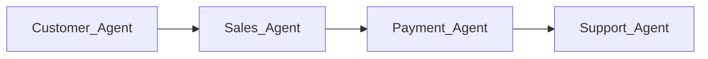
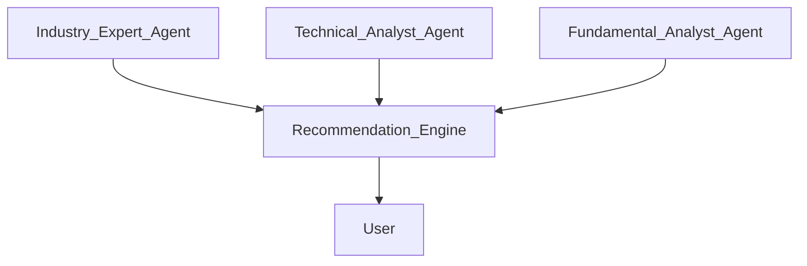

# 🤝 Multi-Agent Design Patterns Explained Simply

---

## 📌 **What is a Multi-Agent Design Pattern?**

A multi-agent design pattern is a system where multiple **AI Agents** collaborate to complete complex tasks efficiently.

---

## 🎯 **When to Use Multi-Agent Patterns?**

| Scenario | Reason | Example |
|---|---|---|
| 🗂️ **Large Workload** | Breaks down large tasks for parallel processing | Big data analysis |
| ⚙️ **Complex Tasks** | Different agents handle different subtasks | Autonomous driving (navigation, obstacle detection, communication) |
| 🎓 **Diverse Expertise** | Each agent has specialized skills | Healthcare systems (diagnosis, treatment, patient care) |

---

## 🌟 **Advantages: Single Agent vs. Multi-Agent**

| Advantage | Single Agent ❌ | Multi-Agent ✅ |
|---|---|---|
| 🔀 **Specialization** | Handles everything, less efficient | Focuses on specialized tasks, higher efficiency |
| 📈 **Scalability** | Difficult to scale up | Easily scalable by adding more agents |
| 🛡️ **Fault Tolerance** | One failure can halt the system | Individual failures don't affect the entire system |

---

## 🧩 **Core Components of Multi-Agent Systems**

- 📡 **Agent Communication**:  
Agents share information, such as travel dates between flight and hotel agents.

- 🔗 **Coordination Mechanisms**: Agents coordinate to maintain consistent data and actions.

- 🧠 **Agent Architecture**: Internal decision-making and learning structure of each agent.

- 🔍 **Interaction Visibility**: Tools and methods to monitor and visualize agent interactions.

#### 📊 **Example of Agent Interaction:**

---

## 🎨 **Common Multi-Agent Patterns**

Here are commonly used multi-agent patterns:

### 📢 **Group Chat**

Agents collaborate through group communication:

Typical uses: Team collaboration, customer support, social media.

---

### 🔄 **Hand-off**

Agents pass tasks between each other:

Typical uses: Customer support processes, workflow automation.

---

### 🤖 **Collaborative Filtering**

Agents jointly make recommendations:

Typical uses: Stock recommendations, product recommendations.

---

## 📌 **Scenario Example: Refund Process**

| Agent Type | Agent Name | Responsibility |
|---|---|---|
| 🔖 Refund-specific Agents | Customer Agent | Initiates refund requests |
| 🔖 Refund-specific Agents | Seller Agent | Processes refund |
| 🔖 Refund-specific Agents | Payment Agent | Executes payment refunds |
| 🔖 Refund-specific Agents | Compliance Agent | Ensures refunds comply with regulations |

| General Agents | Purpose |
|---|---|
| 📦 Shipping Agent | Manages return logistics |
| 📢 Notification Agent | Updates customers about refund status |
| 📈 Analytics Agent | Analyzes refund data |
| 🔍 Audit Agent | Reviews refund procedures |

---

## 🎓 **Exercise**

Design a multi-agent customer support system. Identify necessary agents, their roles, and how they interact with each other.

> 💡 Tip: Think about each step in the customer support process and necessary collaborations.

---

## 📚 **Summary**

Multi-agent design patterns improve efficiency, scalability, and reliability, especially beneficial for complex and large-scale tasks.

---

🎉 **Additional Resources**  
- [AutoGen Design Patterns](https://microsoft.github.io/autogen/stable/user-guide/core-user-guide/design-patterns/intro.html)
- [Agentic Design Patterns](https://www.analyticsvidhya.com/blog/2024/10/agentic-design-patterns/)