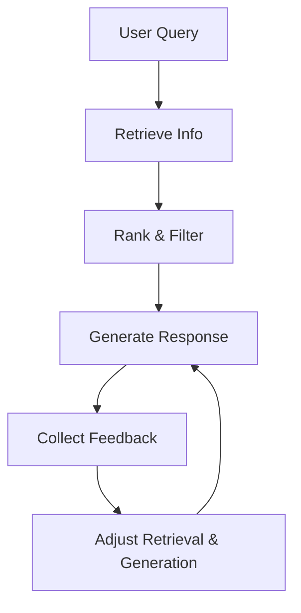
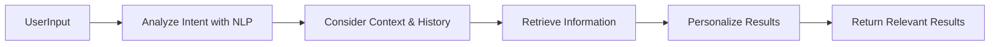
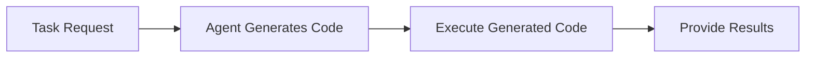
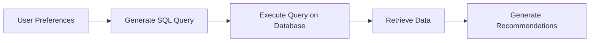
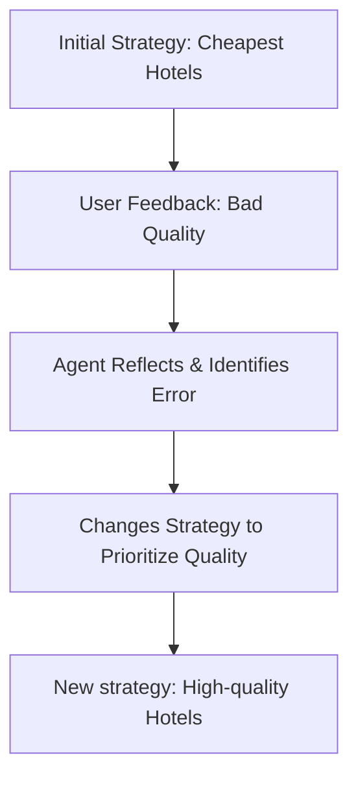

# 🧠 AI Agents and Metacognition Explained Simply

---

## 🚩 **What is Metacognition?**
Metacognition is *thinking about thinking*. For AI agents, this means they evaluate and improve their actions by reflecting on their decisions and outcomes.

**Simple Example:**  
🗣️ “I chose this hotel because it was cheap, but users didn't like its quality. Maybe I should prioritize quality next time.”

### 🌟 Importance in AI
| Importance           | Benefit                                                    | Example                                              |
|----------------------|------------------------------------------------------------|-------------------------------------------------------|
| 🔍 **Self-Reflection**| Agents check their past actions to improve future decisions. | Agent realizes choosing the cheapest flight overlooked comfort. |
| 🔄 **Adaptability**| Agents adjust strategies based on feedback and environment. | Agent avoids crowded tourist spots after user complaints. |
| ✅ **Error Correction**| Agents identify and fix their mistakes automatically. | Agent checks hotel availability after past booking errors. |
| ⚙️ **Resource Management**| Agents optimize resource use (time, computing power). | Agent prioritizes critical tasks when resources are limited. |

---

## 🤖 **Components of an AI Agent**

| Component | Explanation | Example |
|-----------|--------------|-----------|
| 😄 **Persona**| Defines agent's personality and interaction style.| Friendly, professional, formal. |
| 🛠️ **Tools**| Actions an agent can perform.| Searching databases, booking flights.|
| 🎓 **Skills**| Agent's knowledge base and expertise.| Travel recommendations, programming.|

**Example AI Travel Agent:**  
Helps users plan trips, learns from user feedback, and adapts future recommendations.

---

## 📌 **Planning in Agents**

AI agents use planning to achieve goals by organizing actions clearly.

| Step | Example in Travel Planning |
|------|---------------------|
| 🎯 **Define Task** | "Plan a trip to Paris" |
| 📋 **Breakdown Steps** | Collect preferences → Search options → Recommend itinerary → Adjust on feedback |
| 🔍 **Identify Resources** | Flight/hotel databases, user feedback data |
| 📚 **Learn from Experience** | Analyze feedback to avoid previous mistakes |

---

## 🛠️ **Corrective Retrieval-Augmented Generation (RAG)**

RAG combines retrieval of external data with generative AI to provide better answers.

**How it Works:**

- **Prompting**: Query external knowledge.
- **Tool**: AI evaluates retrieved info to improve answers.
- **Evaluation**: Agent continually improves from past interactions.

### Example Workflow (Travel Agent):

---

## 🔍 **Searching with Intent**

Agents analyze queries deeply to understand and satisfy the user's real intention:

| Intent Type | Example Query |
|------------------|-----------------------------------|
| 📖 **Informational** | "Best museums in Paris?" |
| 🌐 **Navigational** | "Official website of Louvre Museum" |
| 💳 **Transactional** | "Book hotel in Paris" |

### Process:

---

## 💻 **Generating Code as a Tool**

Agents can create and run code automatically to solve problems or perform tasks.

### Use Cases:
- 🗃️ Data analysis
- 🌐 Web scraping
- 🧮 Automated problem-solving

#### Simple Illustration:

---

## 🔎 **Evaluating Relevancy**

Agents need to ensure the information they fetch is accurate and matches user needs.

| Technique | Description | Example |
|---|---|---|
| 🎯 **Context Awareness** | Understanding the scenario behind queries | Considering user's budget when recommending restaurants |
| 📖 **Accuracy** | Ensuring information is correct & current | Not recommending closed attractions |
| 🗣️ **User Intent** | Inferring true intent behind user queries | Offering budget-friendly options when user asks for affordable choices |
| 🔄 **Feedback Loop** | Continuously improving through user feedback | Adjusting hotel recommendations based on user ratings |

---

## 💾 **SQL as Retrieval-Augmented Generation (RAG)**

SQL can be used by AI agents to dynamically query databases, fetch, and utilize data for generating precise responses.

### Travel Agent Example:

---

## 📌 **Metacognition Illustrated Example:**

AI agent for hotel booking initially prioritizes low cost. If users report negative experiences (e.g., poor quality), it self-reflects and adapts the strategy to prioritize hotel quality.

---

## 🌟 **Key Summary**

| Concept | Meaning | Why it Matters |
|---------|---------|----------------|
| 🧠 **Metacognition** | Thinking about own actions to improve decisions. | Makes agents smarter, adaptable, efficient. |
| 📋 **Planning** | Structured steps to achieve goals effectively. | Ensures clarity and efficient resource usage. |
| 🔍 **Corrective RAG** | Retrieving external info to correct and enhance outputs. | Ensures accuracy and improves continuously. |
| 🎯 **Intent Search** | Understanding real user needs behind queries. | Improves relevance and satisfaction. |
| 💻 **Code Generation** | Agents generating and executing code dynamically. | Automates complex problem-solving. |
| 📊 **Relevancy Scoring** | Assessing accuracy and context of responses. | Ensures high-quality user experiences. |

---

🚀 **Applying Metacognition:**  
Build self-aware, reflective AI agents that continuously learn from their experiences, provide accurate, personalized recommendations, and effectively manage resources.