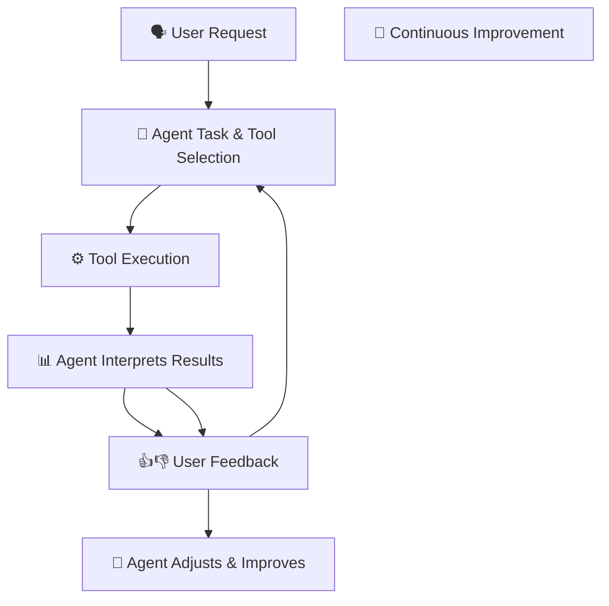
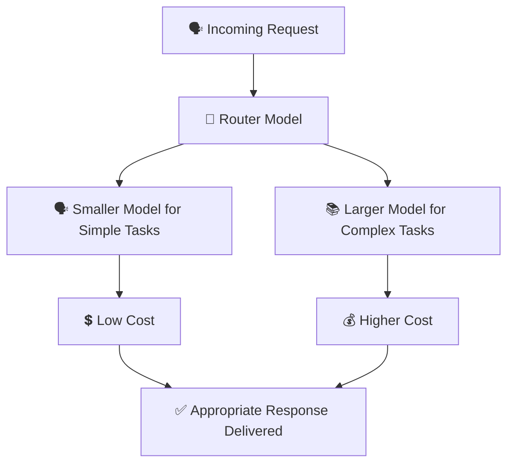

# 🚀 AI Agents in Production Explained Simply

---

## 📌 **What is Deploying AI Agents to Production?**

Deploying AI Agents in production means setting up AI-powered agents so they can reliably interact with users in real-world environments, providing consistent, effective, and efficient services.

The deployment involves:
- ✅ Effective planning
- 🛠️ Handling common issues
- 💰 Managing costs without compromising performance

---

## 🎯 **Goals for Deploying AI Agents**

| Goal | Description |
|------|-------------|
| 📈 **Effective Planning** | Carefully prepare to deploy smoothly |
| 🐞 **Avoid Common Issues** | Understand typical pitfalls and how to avoid them |
| 💲 **Cost Management** | Balance agent performance and operational costs |

---

## 🛠️ **Evaluating AI Agents**

To ensure AI agents align with user and business needs, regular evaluation is crucial at every stage:

| Evaluation Stage | What to Evaluate | Purpose |
|------------------|------------------|---------|
| 🎬 **Initial Model Request** | User’s request clarity | Ensure clarity in the initial input |
| 🎯 **Agent Understanding** | Agent identifies the right tasks and tools | Confirm task & tool identification accuracy |
| ⚙️ **Tool Response** | How well external tools respond to the agent | Ensure tools return accurate and timely results |
| 🤖 **Agent Interpretation** | How agent interprets the tool’s response | Ensure interpretation accuracy |
| 🗣️ **User Feedback** | User feedback for continuous improvement | Continuously refine the agent’s accuracy |

---

## 📌 **Evaluation Process Explained Visually**

### 📌 **AI Agent Evaluation Flow:**

---

## 🚨 **Common Issues & Solutions**

| Issue | Solutions |
|-------------------|-----------|
| 🔄 **Agent Loops (Continuous Loops)** | - Set clear termination conditions - Use a controlling agent for complex reasoning |
| 🎯 **Unclear Objectives** | - Clearly refine and state goals in agent prompts |
| 🤔 **Task Overload** | - Split large tasks into smaller subtasks handled by multiple agents |

---

## 💸 **Cost Management Strategies**

Effective ways to control costs without losing performance:

| Strategy | Explanation | Example |
|-----------|-------------|---------|
| 📁 **Caching Responses** | Save repeated responses to reduce repeated processing costs | Store commonly requested data for reuse |
| 🗣️ **Use Smaller Models (SLMs)** | Use smaller, cheaper models for simple tasks | Simple Q&A handled by smaller models |
| 🔀 **Router Model** | Direct tasks efficiently to suitable agents or models | Route simple queries to low-cost models |

### 📌 **Cost Management Visualization:**

---

## 🔍 **Managing Costs Effectively**

Managing costs without compromising agent performance:

| Strategy | Explanation | Practical Example |
|----------|-------------|-------------------|
| 📦 **Caching Results** | Reuse frequently accessed data | Caching FAQs |
| 🧩 **Multi-Agent Architecture** | Allocate tasks to specialized agents to optimize resource usage | Booking flights (Agent A) & hotels (Agent B) separately |
| 📊 **Monitoring & Evaluation** | Regularly monitor performance and adjust | Continuously evaluate performance of smaller vs larger models |

---

## 📗 **Key Takeaways**

- Effective deployment of AI agents requires **clear planning, ongoing evaluation**, and **cost management**.
- Anticipate and prevent common deployment issues, such as unclear objectives or loops.
- Use a combination of caching, smaller models, and efficient routing to manage costs effectively.

---

## 🌟 **Additional Resources**

- [Building Trustworthy AI Agents](https://learn.microsoft.com/azure/ai-services/agents/trustworthy-ai)
- [Azure AI Agent Documentation](https://learn.microsoft.com/azure/ai-services/agents/overview)
- [Semantic Kernel Guide](https://learn.microsoft.com/semantic-kernel/frameworks/)
- [AutoGen Official Guide](https://microsoft.github.io/autogen/)