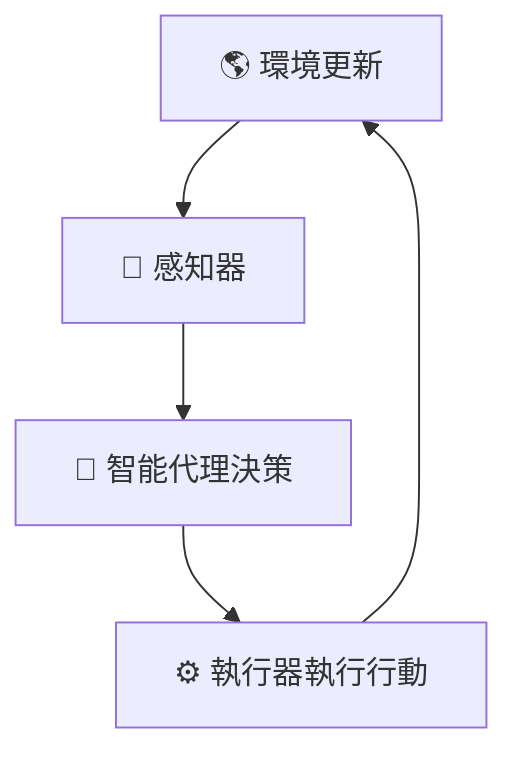
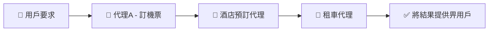
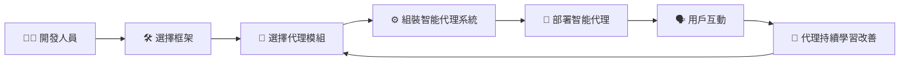
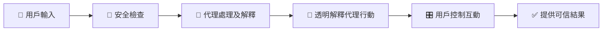

# 🤖 AI 智能代理介紹及應用場景（簡單易明版）

---

## 📌 **咩係 AI 智能代理（AI Agents）？**

**AI 智能代理**係透過**大型語言模型（LLMs）**結合外部工具同知識，協助用戶完成特定任務嘅智能系統。

AI 智能代理主要包括以下元素：

| 元素 | 解釋 | 例子（旅行代理） |
|---------|-------------|-----------------------|
| 🌎 **環境（Environment）** | 代理運作嘅空間或平台 | 旅行訂位系統 |
| 📡 **感知器（Sensors）** | 收集環境資訊嘅工具 | 查詢航班空位 |
| ⚙️ **執行器（Actuators）** | 根據資訊執行行動嘅工具 | 訂酒店房間 |

---

## 🎯 **AI 智能代理嘅種類**

唔同類型嘅AI智能代理處理任務嘅方式各有唔同：

| 代理類型 | 描述 | 例子 |
|------------|-------------|----------|
| 🔍 **簡單反射型（Simple Reflex）** | 根據即時情況即刻做決定 | 即時轉發緊急電郵 |
| 📈 **模型型（Model-Based）** | 根據環境模型作出行動 | 根據交通情況調整路線 |
| 🎯 **目標型（Goal-Based）** | 制訂並完成特定目標 | 完整規劃旅行行程 |
| ⚖️ **效用型（Utility-Based）** | 平衡多個因素作決定 | 訂航班時平衡成本與方便性 |
| 📚 **學習型（Learning）** | 透過反饋持續改善 | 根據客戶評價改善建議 |

---

## 🚦 **幾時用 AI 智能代理？**

AI 智能代理適用於以下情境：

| 情境 | 點解用AI智能代理？ | 例子 |
|-----------|-------------|---------|
| 🌀 **開放式任務** | 任務冇固定步驟 | 創意內容生成 |
| 🔄 **多步驟流程** | 任務較複雜，有多個步驟 | 訂航班、酒店同租車 |
| 📚 **持續改善** | 能從經驗中持續學習 | 客服聊天機械人 |

---

## 🛠️ **AI智能代理嘅基本架構**

AI智能代理一般包含以下核心元素：

### 📌 **AI智能代理互動視覺化：**

---

## 🌟 **其他AI智能代理類型**

| 代理類型 | 描述 | 例子 |
|------------|-------------|---------|
| 📖 **知識型代理（Knowledge Agent）** | 根據數據提供資訊 | 常見問題解答 |
| 🤝 **協作型代理（Collaborative Agent）** | 協同人或其他代理完成任務 | 安排團隊會議 |
| ⚙️ **自主型代理（Autonomous Agent）** | 獨立完成任務 | 自動駕駛汽車 |

---

## 📗 **智能代理設計重要原則**

設計有效嘅智能代理需考慮以下原則：

- 🧩 **模組化（Modularity）** – 靈活重用組件
- 🔄 **反覆改善（Iterative Improvement）** – 從反饋中改善
- 🤝 **協作（Collaboration）** – 多個代理有效合作

### 📌 **代理協作視覺化：**

---

## 🚧 **使用AI智能代理框架**

智能代理框架可以簡化智能代理嘅開發：

| 框架 | 強項 | 最適合場景 |
|-----------|----------|-----------|
| 🧑‍🔬 **AutoGen** | 多代理協作 | 複雜多代理互動 |
| 📘 **Semantic Kernel** | 模組化，易整合 | 企業級應用 |
| ☁️ **Azure AI Agent Service** | 可擴展性、安全性 | 大規模企業應用 |

---

## ⚙️ **智能代理框架流程**

使用框架時嘅典型流程：

### 📌 **智能代理框架流程圖：**

---

## 🔒 **智能代理嘅安全性與信任**

要建立用戶對智能代理嘅信任，需要考慮：

| 考慮因素 | 解釋 | 實踐建議 |
|---------------|-------------|---------------|
| 🔒 **安全性（Security）** | 保護數據與工具使用安全 | 使用安全API、限制存取 |
| 🧾 **透明度（Transparency）** | 清晰溝通代理行為 | 提供操作原因解釋 |
| 🎛️ **用戶控制（User Control）** | 用戶管理數據及互動方式 | 允許數據刪除、偏好設定 |

### 📌 **安全與信任視覺化：**

---

## 📚 **總結及重點**

- **AI智能代理**利用LLMs及工具自動處理任務。
- 好嘅代理設計需注意模組化、反覆改善及協作。
- 智能代理框架令代理開發更快速。
- 重視安全、透明及用戶控制去提升信任。