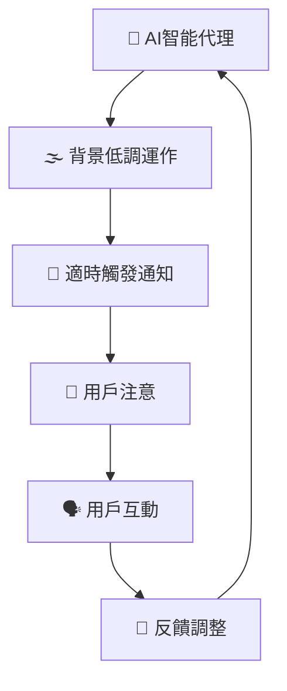
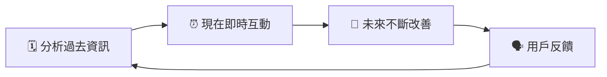
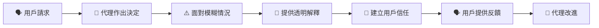
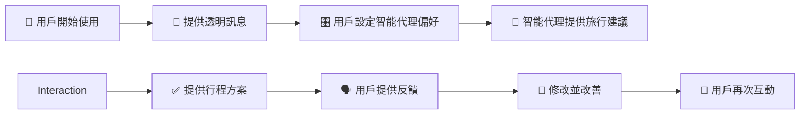

# 🧩 理解智能代理設計原則（簡單易明版）

---

## 📌 **咩係 AI 智能代理設計原則？**

**AI智能代理設計原則** 係一套幫助你設計AI智能代理嘅基本指引，目的係幫助人類更有效完成各種複雜任務，同時增強人與AI之間嘅互動同信任感。

AI智能代理應該：
- 🚀 擴展人類嘅能力（例如自動化任務、創意構思）
- 📚 幫助用戶填補知識缺口（例如快速翻譯、提供專業知識）
- 🤝 促進人與人之間嘅合作同溝通
- 🌟 協助用戶成為更好嘅自己

---

## 🎯 **AI智能代理設計原則嘅重要性**

| 優點 | 解釋 | 例子 |
|---------|-------------|---------|
| 🚀 **提升能力** | 擴展人類能力同效率 | 自動化重複工作 |
| 📖 **補充知識** | 快速填補知識空白 | 即時翻譯唔同語言嘅文件 |
| 🤝 **促進合作** | 協助溝通合作 | 協調團隊任務 |
| 🦸 **個人提升** | 提升個人效率同決策力 | 提供即時提醒同資訊 |

---

## 🌐 **智能代理互動環境設計**

AI智能代理應融入用戶嘅日常生活或工作流程中：

- **連結而非取代**：智能代理應該連結知識、事件同人，而唔係取代人類角色。
- **隱形但易於存取**：智能代理一般喺背景運行，只喺適當時候主動提醒用戶。

### 📌 **智能代理運作流程示意圖：**

---

## 🕰️ **智能代理時間維度（過去、現在、未來）**

智能代理應該能處理過去、現在同未來嘅資訊：

| 時間維度 | 代理角色 | 例子 |
|------|------------|---------|
| 🗓️ **過去** | 分析過去嘅資訊，協助決策 | 回顧過去會議紀錄提供總結 |
| ⏰ **現在** | 即時通知同提醒 | 提醒重要訊息或會議 |
| 🚀 **未來** | 持續適應用戶需求 | 根據用戶習慣不斷優化 |

### 📌 **智能代理時序示意圖：**

---

## 🔑 **智能代理核心設計要素**

設計值得信任嘅智能代理，核心設計元素包括：

| 設計要素 | 解釋 | 例子 |
|---------|-------------|---------|
| 🌫️ **接受適當不確定性** | 接受一定程度嘅模糊，以提高靈活性 | 持續改善答案 |
| 🤝 **建立信任** | 提供透明化嘅解釋，增強用戶信任 | 清晰交代智能代理嘅決策過程 |

### 📌 **智能代理信任建立流程圖：**

---

## ⚙️ **設計值得信賴智能代理嘅指引**

設計智能代理時，應注意以下重點：

| 原則 | 解釋 | 實際例子（旅行代理） |
|---------------|-------------|----------------|
| 🧾 **透明度** | 讓用戶知道AI嘅角色及操作方式 | 提供初始說明：「我係一個智能代理...」 |
| 🎛️ **控制權** | 用戶可設定代理嘅個性、說話風格及資料管理 | 可調節回覆嘅詳細程度、刪除對話紀錄 |
| 🔄 **一致性** | 提供標準、統一嘅使用體驗 | 統一使用 📅預訂, ✈️機票, 🏨酒店 等圖標 |

---

## 🗺️ **示例：旅行智能代理設計**

試想設計一個旅行代理，根據上述原則設計：

- **透明度**：清楚表明智能代理嘅身份，提供簡單使用指引。
- **控制權**：用戶可調整代理詳細程度、語氣、管理歷史資料。
- **一致性**：統一標準嘅使用者界面圖示同互動模式。

### 📌 **旅行智能代理設計視覺化示例：**

---

## 📚 **重點回顧**

- AI智能代理設計原則提升用戶同AI嘅互動體驗，並增強信任感。
- 接受少量嘅不確定性可提升代理嘅靈活性。
- 建立透明度、用戶控制權同一致性係智能代理設計嘅關鍵。

---

## 🌟 **延伸參考資源**

- [OpenAI - Agentic AI治理最佳實踐](https://openai.com)
- [Microsoft Research - HAX Toolkit](https://microsoft.com)
- [Responsible AI Toolkit](https://responsibleaitoolbox.ai)