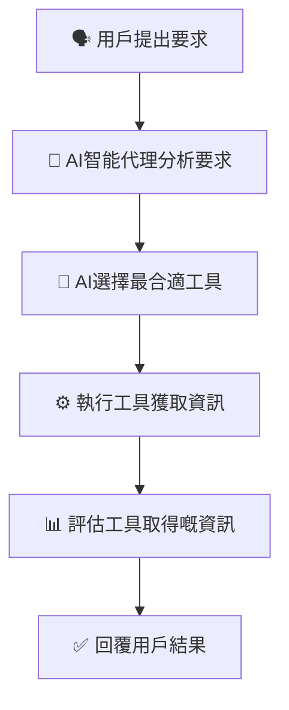
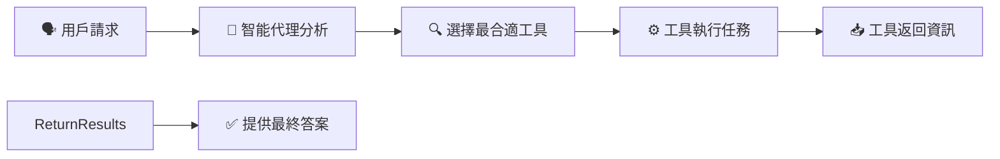
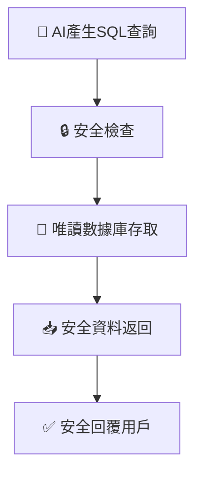
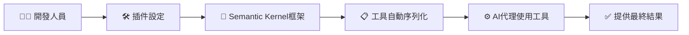

# 🛠️ 工具使用設計模式（Tool Use Design Pattern）簡單易明版

---

## 📌 **咩係工具使用設計模式？**

**工具使用設計模式（Tool Use Design Pattern）** 係一種令智能代理透過外部工具（如函式或API）去完成特定任務嘅方法，大幅提升智能代理嘅能力。

例如：
- 🧮 使用計算工具進行計算
- 📊 透過API獲取即時資訊

---

## 🎯 **工具使用設計模式嘅重要性**

| 優點 | 解釋 | 實際例子 |
|---|---|---|
| 📡 **動態資訊獲取** | 即時從外部獲取資料 | 查詢股票價格、天氣預報 |
| 💻 **程式碼執行與分析** | 自動執行程式碼分析數據 | 解數學題目、數據分析 |
| ⚙️ **工作流程自動化** | 自動執行重複嘅工作流程 | 自動發送電郵、任務調度 |
| 🙋 **客戶支援** | 與CRM及知識庫互動 | 自動處理客戶問題 |
| 📝 **內容創作同編輯** | 輔助生成同修改內容 | 文法檢查、摘要生成 |

---

## 📌 **工具使用設計模式嘅運作流程**

智能代理透過以下步驟使用工具：

1. 用戶提出問題。
2. 智能代理分析，選擇適合工具。
3. 執行所選工具獲取結果。
4. 評估結果並生成最終答案。

### 📌 **工具使用設計模式流程圖：**

---

## 🛠️ **工具使用設計模式嘅核心組件**

| 組件 | 解釋 | 例子 |
|-----------|-------------|---------|
| 📞 **功能或工具調用** | 智能代理識別同使用合適嘅工具 | 呼叫API獲取城市時間 |
| 📥 **動態資料獲取** | 即時存取最新資訊 | 股票報價、天氣資訊 |
| 🖥️ **程式碼執行** | 自動執行代碼解決問題 | 執行數據分析腳本 |
| 🔄 **自動化工作流程** | 整合不同工具完成複雜任務 | 自動化訂單處理系統 |

---

## ⚙️ **點樣實現工具調用功能？**

功能調用係透過以下流程進行：

- 用戶提供需求（例如：「查下而家三藩市幾點？」）
- 智能代理選擇最合適嘅工具。
- 工具執行後，將結果返回智能代理。
- 智能代理再整合資訊，生成答案俾用戶。

### 📌 **功能調用視覺化示例：**

---

## 🚧 **使用工具設計模式嘅安全考慮**

使用外部工具時需注意嘅安全措施：

| 安全考慮 | 解釋 | 建議 |
|---------------|-------------|----------------|
| 🚫 **防止SQL注入攻擊** | 防止數據庫遭惡意操作 | 限制數據庫權限（只讀） |
| 🔒 **安全環境運作** | 工具需在安全環境內運行 | 使用受控環境 |
| 🔐 **敏感數據保護** | 限制代理存取敏感數據 | 定期審核訪問權限 |

### 📌 **安全實施視覺示例：**

---

## ☁️ **透過框架實現工具使用**

透過以下框架能更容易實現工具使用：

| 框架名稱 | 優點 | 適用場景 |
|-----------|------------|---------|
| 🧩 **Semantic Kernel** | 易於設定，自帶常用工具 | 文件自動摘要 |
| ☁️ **Azure AI Agent Service** | 安全、管理簡單 | 企業級系統整合 |

### 📌 **框架運作流程圖示例（Semantic Kernel）:**

---

## 📚 **總結同重點**

- 工具使用設計模式允許智能代理擴展功能，靈活解決問題。
- 自動執行工具增加代理處理複雜任務能力。
- 透過安全措施確保工具使用安全可靠。
- 使用成熟嘅AI框架簡化工具嘅整合同管理。

---

## 🌟 **更多參考資源**

- [Azure AI Service 實戰教程](https://learn.microsoft.com/training/modules/use-own-data-azure-openai)
- [Semantic Kernel 官方教學](https://learn.microsoft.com/semantic-kernel/concepts/ai-services/chat-completion/function-calling/?pivots=programming-language-python)
- [Autogen 工具指南](https://microsoft.github.io/autogen/dev/user-guide/core-user-guide/components/tools.html)