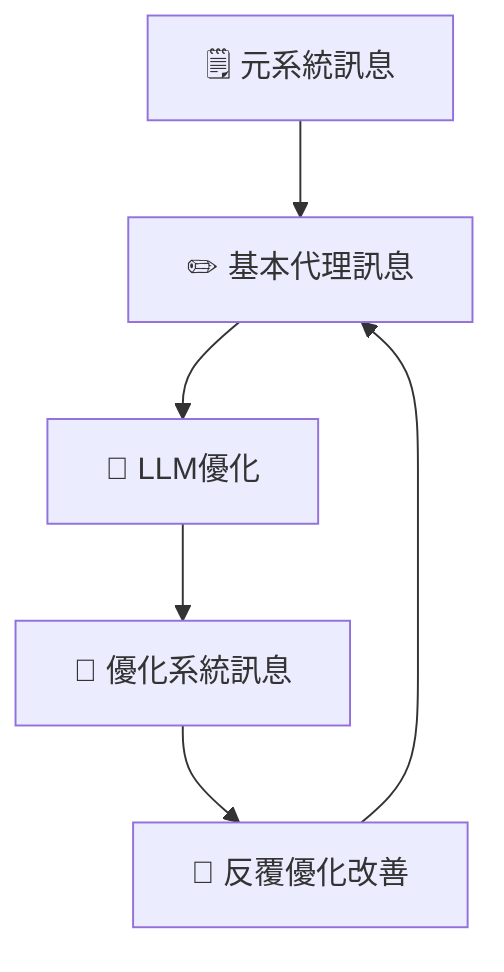
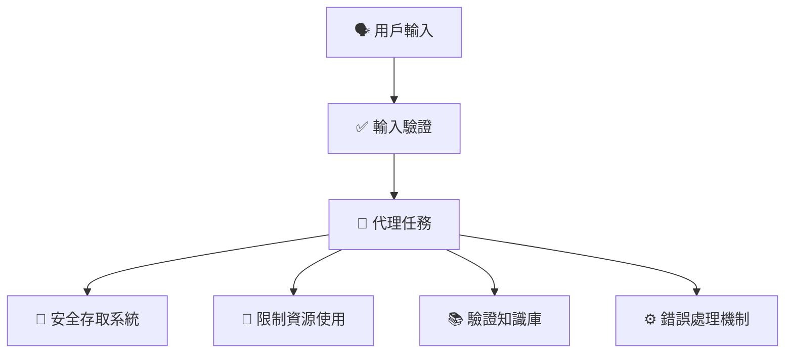
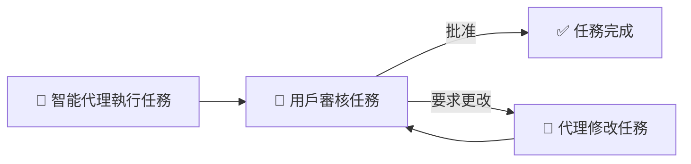

# 🛡️ 建立值得信賴嘅智能代理（簡單易明版）

---

## 📌 **咩係「值得信賴嘅智能代理」？**

建立 **值得信賴嘅智能代理** 就係確保AI系統安全可靠、保障用戶私隱，同時能有效完成任務。

---

## 🎯 **智能代理值得信賴嘅重要性**

| 重要性 | 解釋 | 例子 |
|---|---|---|
| ✅ **安全性（Safety）** | 代理執行任務時準確、唔會做錯或帶嚟傷害 | 準確預訂航班，避免出錯 |
| 🔐 **保安性（Security）** | 保護AI系統同數據，防止未授權存取 | 防止黑客篡改航班預訂資料 |
| 🕵️ **私隱保護（Privacy）** | 確保用戶數據私密安全 | 個人資料唔會洩漏 |

---

## 🧱 **建立值得信賴智能代理嘅步驟**

### 📝 **系統訊息框架（System Message Framework）**

透過結構化嘅指示，智能代理能清晰理解自己嘅角色同任務。

#### 📌 **框架步驟：**

| 步驟 | 解釋 | 例子 |
|------|-------------|---------|
| 1️⃣ **建立元系統訊息** | 建立一個可用於不同代理嘅一般模板 | 「你係一個建立AI助理嘅專家…」 |
| 2️⃣ **建立基本代理訊息** | 清楚描述代理嘅角色同任務 | 「你係負責訂機票嘅旅行代理…」 |
| 3️⃣ **透過LLM優化訊息** | 用AI模型優化訊息內容 | 清晰列出職責、目標、溝通風格 |
| 4️⃣ **不斷反覆優化** | 根據反饋，持續改進訊息 | 根據用戶回應持續改善 |

### 📌 **視覺化框架示例：**

---

## 🚨 **認識安全威脅（Security Threats）**

以下係智能代理常見嘅保安威脅同應對方法：

| 威脅類型 | 描述 | 防範措施 |
|---|---|---|
| 📍 **任務同指令篡改** | 攻擊者試圖改變代理指示 | 驗證用戶輸入，限制互動次數 |
| 🔑 **敏感系統存取** | 透過代理存取敏感資料或系統 | 設定嚴格嘅存取控制 |
| 📛 **資源同服務過載** | 利用代理大量請求服務，導致系統故障 | 限制代理嘅請求數量 |
| 🗂️ **知識庫污染** | 污染代理使用嘅數據 | 定期驗證資料完整性 |
| ⚠️ **錯誤連鎖反應** | 一個系統錯誤引起其他系統故障 | 隔離代理環境、加入錯誤處理機制 |

### 📌 **安全威脅防範流程圖：**

---

## 🙋 **人機協作（Human-in-the-Loop）**

用戶積極參與監督智能代理運作，確保代理結果符合用戶期望。

| 好處 | 解釋 | 例子 |
|---|---|---|
| 🗨️ **即時反饋** | 用戶即時提供反饋 | 用戶批准或修改航班預訂 |
| 🔄 **持續改善** | 根據用戶意見持續改善代理輸出 | 根據用戶修改即時更新 |

### 📌 **人機協作視覺示例：**

---

## 📚 **總結同重點**

- 建立值得信賴嘅智能代理需要**清晰指引**、**嚴格嘅保安措施** 同 **私隱保護**。
- 系統化嘅訊息框架有助代理清晰明白任務。
- 定期安全評估同防範措施保障系統安全。
- 人機協作確保代理符合用戶需求，更有效率。

---

## 🌟 **更多參考資源**

- [負責任AI概覽](https://learn.microsoft.com/azure/ai-studio/responsible-use-of-ai-overview)
- [生成式AI評估](https://learn.microsoft.com/azure/ai-studio/concepts/evaluation-approach-gen-ai)
- [系統安全訊息](https://learn.microsoft.com/azure/ai-services/openai/concepts/system-message?context=%2Fazure%2Fai-studio%2Fcontext%2Fcontext&tabs=top-techniques)
- [風險評估模板](https://blogs.microsoft.com/wp-content/uploads/prod/sites/5/2022/06/Microsoft-RAI-Impact-Assessment-Template.pdf?culture=en-us&country=us)