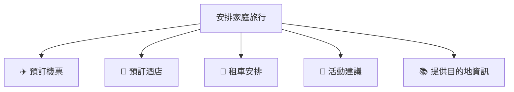
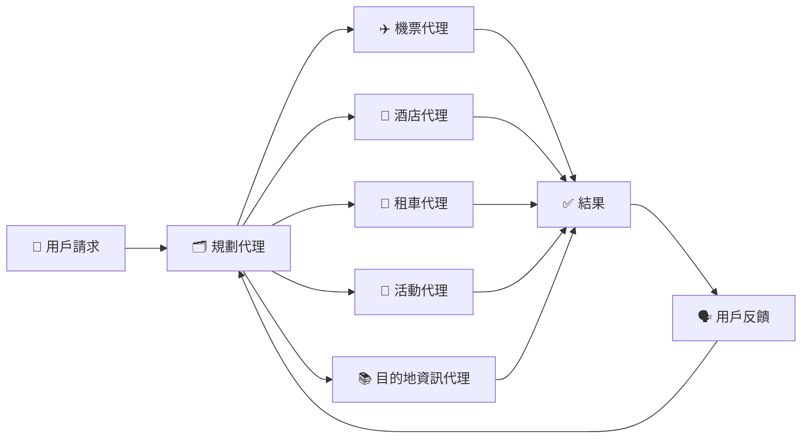
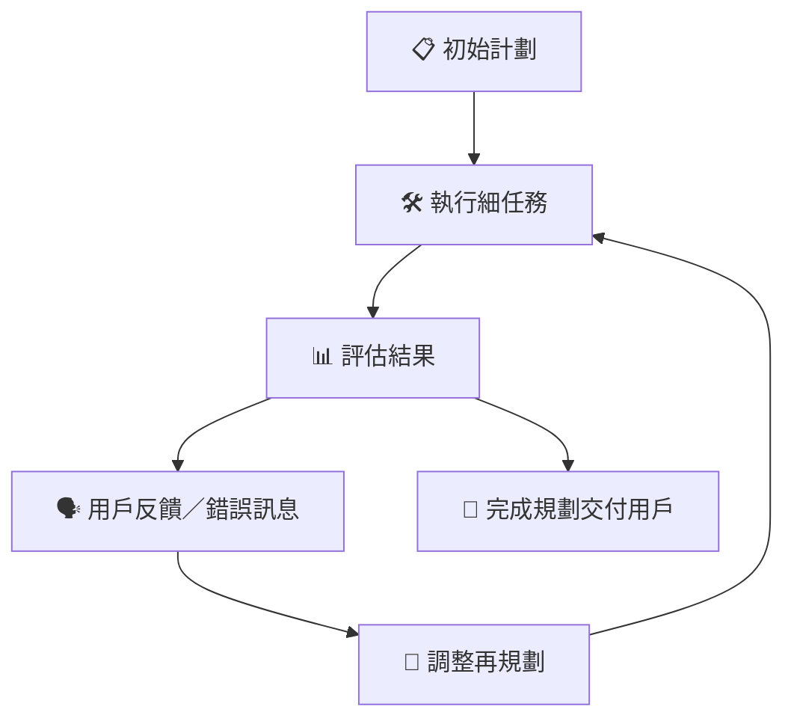
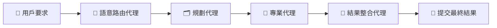

# 📅 智能代理規劃設計模式（簡單易明版）

---

## 📌 **咩係智能代理嘅規劃（Planning）？**

智能代理嘅規劃係指清晰定義目標，將複雜嘅任務拆分成細任務，逐步執行。

**例如目標：**「安排一個三日兩夜旅行行程」

清晰嘅規劃令智能代理能夠準確提供機票、酒店同活動建議等安排。

---

## 🎯 **智能代理規劃嘅重要性：**

| 優點 | 解釋 | 例子 |
|---|---|---|
| 🎯 **目標清晰** | 明確知道做乜嘢，結果更準確 | 「預訂墨爾本嘅酒店同機票」 |
| 🧩 **任務拆解** | 將複雜任務變成易管理嘅細任務 | 一個代理負責機票，一個負責酒店 |
| 🛠️ **工具整合** | 適時使用正確工具 | 搜尋工具、預訂系統、數據分析 |
| 🔄 **反覆改善** | 根據反饋調整任務 | 用戶偏好更早嘅航班，就即時調整行程 |

---

## 🧩 **任務拆解（Subtasking）**

將大任務拆分成易理解嘅細任務：

| 主任務 | 細任務 | 專業智能代理 |
|-----------|-----------|-----------------------|
| 🌎 **旅行規劃** | ✈️ 機票預訂 | 機票代理 |
| 🏨 **住宿安排** | 酒店代理 |
| 🚗 **交通工具** | 租車代理 |
| 🎡 **活動安排** | 活動推薦代理 |

### 📌 **任務拆解視覺示例：**



---

## 📑 **結構化輸出（Structured Output）**

使用結構化輸出（如JSON），智能代理之間更容易溝通同協調任務。

### 📌 **結構化輸出示例：**
```json
{
  "main_task": "安排由新加坡到墨爾本嘅家庭旅行。",
  "subtasks": [
    {"assigned_agent": "flight_booking", "task_details": "預訂機票"},
    {"assigned_agent": "hotel_booking", "task_details": "適合家庭嘅酒店"},
    {"assigned_agent": "car_rental", "task_details": "租適合4人嘅車"},
    {"assigned_agent": "activities_booking", "task_details": "家庭活動推薦"},
    {"assigned_agent": "destination_info", "task_details": "墨爾本旅遊資訊"}
  ]
}
```

### 📌 **結構化輸出使用視覺示例：**



---

## 🚨 **事件驅動及反覆規劃（Event-driven & Iterative Planning）**

智能代理必須快速適應動態情況，呢個就係「反覆規劃」，每個決定會影響下一步行動。

| 情境 | 行動 |
|---|---|
| ⚠️ **意外數據格式** | 預訂過程出錯後即時調整策略 |
| 🔄 **用戶反饋** | 用戶想提早航班，智能代理即刻重新規劃 |

### 📌 **反覆規劃流程：**


---

## 🛠️ **智能代理任務協調（Agent Orchestration）**

協調者（規劃代理）分配任務予不同專業代理：

- **語意路由**：識別合適代理。
- **任務委派**：分派細任務畀專業代理。
- **結果整合**：清晰咁呈現結果畀用戶。

### 📌 **智能代理任務協調流程：**



---

## 📚 **重點回顧**

- 清晰嘅目標令複雜任務更易處理。
- 結構化輸出幫助代理間更好嘅自動協調。
- 反覆規劃根據實際情況及時調整。
- 專業代理分工合作，規劃代理負責協調整個流程。

---

## 🌟 **延伸資源**

- [AutoGen 結構化輸出](https://microsoft.github.io/autogen/stable/user-guide/core-user-guide/cookbook/structured-output-agent.html)
- [Magnetic One - 多智能代理系統](https://www.microsoft.com/research/articles/magentic-one-a-generalist-multi-agent-system-for-solving-complex-tasks)