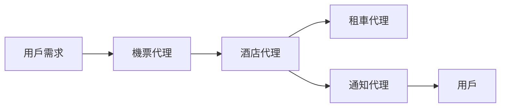
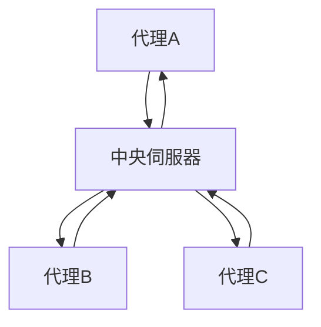
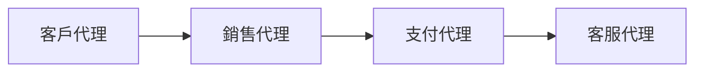
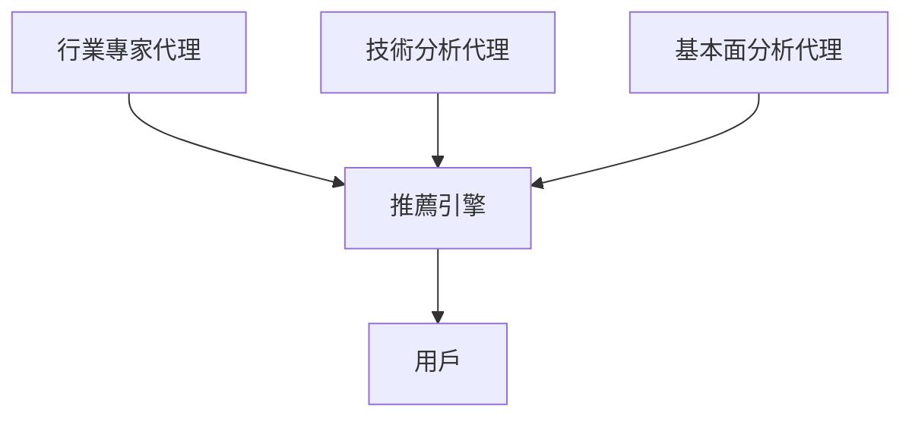

# 🤝 多智能代理設計模式（簡單易明版）

---

## 📌 **咩係多智能代理設計模式？**

多智能代理設計模式，即係由多個**智能代理（AI Agent）**互相合作，完成複雜任務嘅系統設計方式。

---

## 🎯 **幾時適合用多智能代理模式？**

| 情境 | 原因 | 例子 |
|---|---|---|
| 🗂️ **工作量大** | 將大量工作分細，平行處理更快完成 | 大數據分析 |
| ⚙️ **複雜任務** | 唔同智能代理負責唔同任務 | 自動駕駛（導航、障礙檢測、通訊） |
| 🎓 **多種專業** | 每個智能代理有自己專業知識 | 醫療系統（診斷、治療建議、病人監察） |

---

## 🌟 **優勢：單一智能代理 vs. 多智能代理**

| 優勢 | 單一智能代理 ❌ | 多智能代理 ✅ |
|---|---|---|
| 🔀 **專業化** | 一個代理做晒所有嘢，效率較低 | 各代理專注自己專業，更有效率 |
| 📈 **可擴展性** | 難以擴展 | 容易新增代理，系統更易擴展 |
| 🛡️ **容錯性** | 一個出錯影響整個系統 | 個別出錯唔影響整體 |

---

## 🧩 **多智能代理系統嘅核心組成**

- 📡 **代理之間嘅通訊**：  
例如機票代理同酒店代理之間共享旅行日期資訊。

- 🔗 **協調機制**：  
代理之間協調行動，確保數據一致。

- 🧠 **代理架構**：  
每個代理內部都有決策同自我學習能力。

- 🔍 **代理互動可視化**：  
使用工具監察、視覺化代理間嘅互動。

#### 📊 **代理互動示例：**

---

## 🎨 **常見嘅多智能代理設計模式**

以下係三個常用嘅設計模式：

### 📢 **群組通訊（Group Chat）**

代理通過群組通訊協作：

適用場景：團隊合作、客服系統、社交網絡。

---

### 🔄 **任務交接（Hand-off）**

代理之間交接任務：

適用場景：客戶服務、自動化工作流程。

---

### 🤖 **協作過濾（Collaborative Filtering）**

多代理共同推薦：

適用場景：股票推薦、產品推薦。

---

## 📌 **情景示例：退款流程**

| 代理類型 | 代理名稱 | 職責 |
|---|---|---|
| 🔖 退款專用代理 | 客戶代理 | 提出退款申請 |
| 🔖 退款專用代理 | 商家代理 | 處理退款請求 |
| 🔖 退款專用代理 | 支付代理 | 執行退款交易 |
| 🔖 退款專用代理 | 合規代理 | 確保退款符合政策法規 |

| 通用代理 | 功能 |
|---|---|
| 📦 運輸代理 | 處理退貨物流 |
| 📢 通知代理 | 通知用戶退款進度 |
| 📈 分析代理 | 分析退款數據 |
| 🔍 審計代理 | 檢查退款流程合規性 |

---

## 🎓 **練習**

試設計一個客戶服務嘅多智能代理系統，列明所需代理、各自職責，以及佢哋點樣互動。

> 💡 提示：思考客服流程每個步驟及需要嘅合作。

---

## 📚 **總結**

使用多智能代理設計模式，可以有效提升系統效率、擴展性同可靠性，特別適合處理複雜或大規模嘅任務。

---

🎉 **延伸資源**  
- [AutoGen Design Patterns](https://microsoft.github.io/autogen/stable/user-guide/core-user-guide/design-patterns/intro.html)
- [Agentic Design Patterns](https://www.analyticsvidhya.com/blog/2024/10/agentic-design-patterns/)