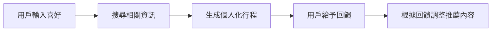
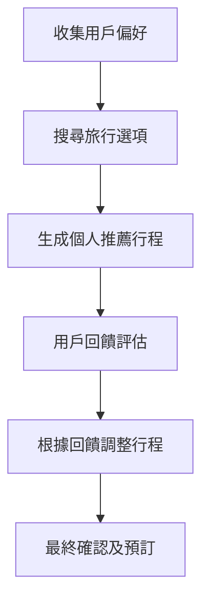
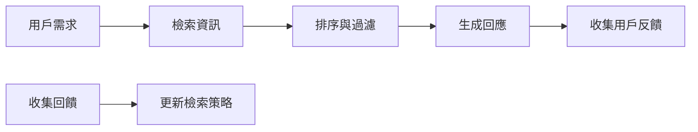
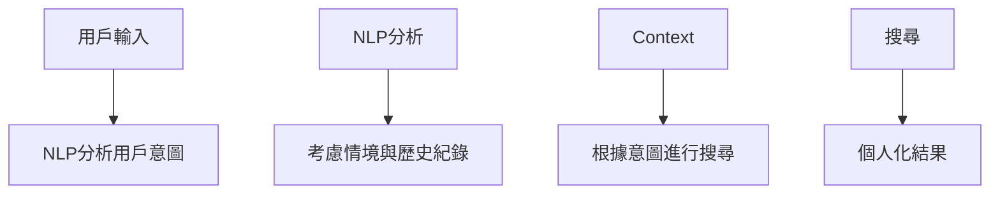
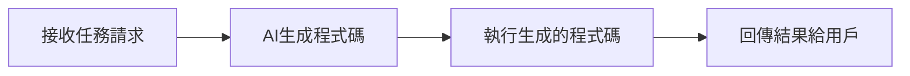
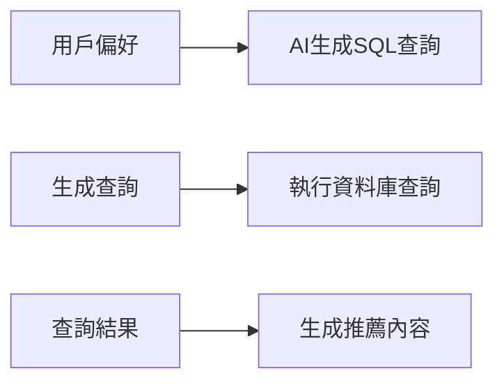
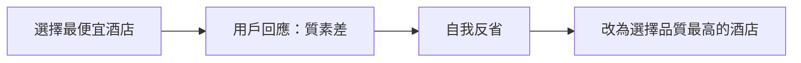

# 🧠 元認知設計模式（簡單易明版）

---

## 🚩 **什麼是元認知（Metacognition）？**
元認知就是 *「思考自己的思考」*。對於AI智能代理來說，這表示它們會評估自己的行為，從錯誤中學習，不斷改善決策方式。

**簡單例子：**  
🗨️ 「我選便宜嘅酒店係因為平，但用戶唔滿意酒店品質，下次我應該要選品質更高的。」

---

## 🎯 **AI智能代理元認知的重要性**
| 關鍵能力 | 意義 | 實際例子 |
|---|---|---|
| 🔍 **自我反省** | 檢視過去決策，持續改善 | AI發現選便宜航班令旅客不舒服，下次改變選擇 |
| 🔄 **適應性** | 根據環境與用戶反饋調整策略 | 用戶反映景點人多，AI下次避開旺季推薦 |
| 🔧 **錯誤修正** | 自動找出及修正錯誤 | 發現酒店已滿後，學習事前仔細檢查房間可用性 |
| ⏳ **資源管理** | 有效分配時間和計算資源 | 預先規劃有效率的搜尋與推薦流程 |

---

## 🤖 **AI智能代理的基本組成元素**
| 元素 | 描述 | 例子 |
|---|---|---|
| 😄 **人格設定** | AI的個性與互動風格 | 友善、專業、正式 |
| 🛠️ **工具** | AI能執行的動作 | 搜尋資料庫、預訂機票 |
| 🎓 **技能** | AI的知識和專長 | 旅行推薦、景點規劃 |

#### 🗺️ **以旅行助理為例的流程圖**

---

## 🛠️ **AI智能代理的計畫規劃（Planning）**

AI透過清晰的步驟來達成目標：

| 步驟 | 描述 | 旅行規劃示例 |
|---|---|---|
| 🎯 **定義任務** | 清晰目標 | 計劃巴黎之旅 |
| 📋 **拆解步驟** | 將任務拆分成小步驟 | 收集偏好 → 搜尋資料 → 建議行程 → 根據回饋調整 |
| 📂 **確定所需資源** | 航班、酒店資料庫 | 用戶喜好數據 |
| 📖 **經驗學習** | 從經驗中學習改善 | 用戶不滿意景點，則下次避免推薦 |

#### 🚗 **旅行助理規劃流程圖**：

---

## 🔧 **修正型RAG系統（Corrective RAG）**

RAG（檢索增強生成）能從知識庫中提取外部資訊，幫助AI生成更準確回覆。

- **提示技巧（Prompting）**：引導AI準確搜尋所需資訊。
- **工具（Tool）**：自動評估並提升回覆品質。
- **持續評估（Evaluation）**：分析用戶回饋，調整AI行為。

#### 🌐 **旅行助理的Corrective RAG示例**

---

## 🔍 **以意圖為導向的搜尋（Search with Intent）**

理解用戶的真正需求，提供最相關的資訊。

| 意圖類型 | 用戶目的 | 例子 |
|---|---|---|
| 📖 資訊型 | 想了解更多資訊 |「巴黎最好的博物館有哪些？」 |
| 🌐 導航型 | 尋找特定網站或頁面 |「盧浮宮官網」|
| 💳 交易型 | 想預訂或購買 |「訂去巴黎的酒店」|

#### 📌 **使用者意圖辨識流程**

---

## 💻 **AI自動產生程式碼（Code Generation）**

AI可生成及執行程式碼，解決複雜問題。

| 應用情境 | 範例 |
|---|---|
| 🧮 自動分析數據 | 生成SQL查詢分析資料 |
| 📊 資料視覺化 | 生成圖表和洞察 |
| 🤖 問題解決 | 即時生成並運行程式碼 |

#### 🛎️ **流程圖示範**

---

## 🎯 **SQL作為RAG技術的示例**

AI可透過SQL即時查詢資料庫，提供精確資訊。

---

## 🏨 **元認知實際示例（酒店推薦）**

- 一開始AI推薦最便宜酒店。
- 用戶反饋「品質差」。
- AI反省後，調整策略，改推薦品質較好的酒店。

---

## 🌟 **總結表格**

| 概念 | 意義 | 價值 |
|---|---|---|
| 🧠 元認知 | AI反省自身決策，不斷改進 | 增加AI的智慧和適應性 |
| 🛠️ 規劃 | 明確步驟完成任務 | 提升效率 |
| 🔧 修正型RAG | 動態檢索與修正回覆 | 提升資訊正確性 |
| 💻 程式碼生成 | AI自動生成並執行程式碼 | 自動解決問題，提高效率 |
| 🎯 意圖識別 | 理解用戶真實需求 | 提供相關且精準的回應 |

---

🎓 透過元認知，設計能持續自我改進的AI智能代理，提升決策品質與用戶體驗！