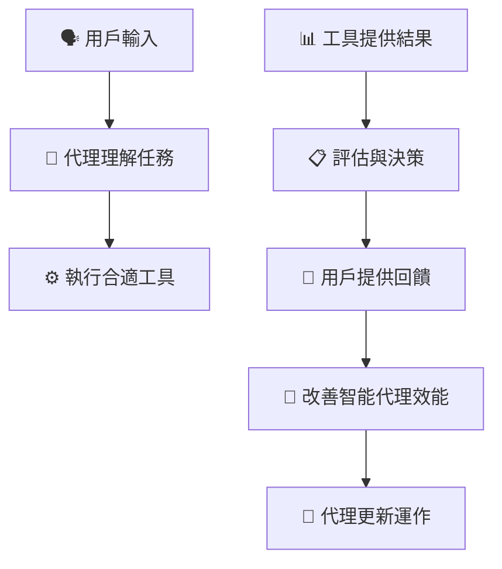
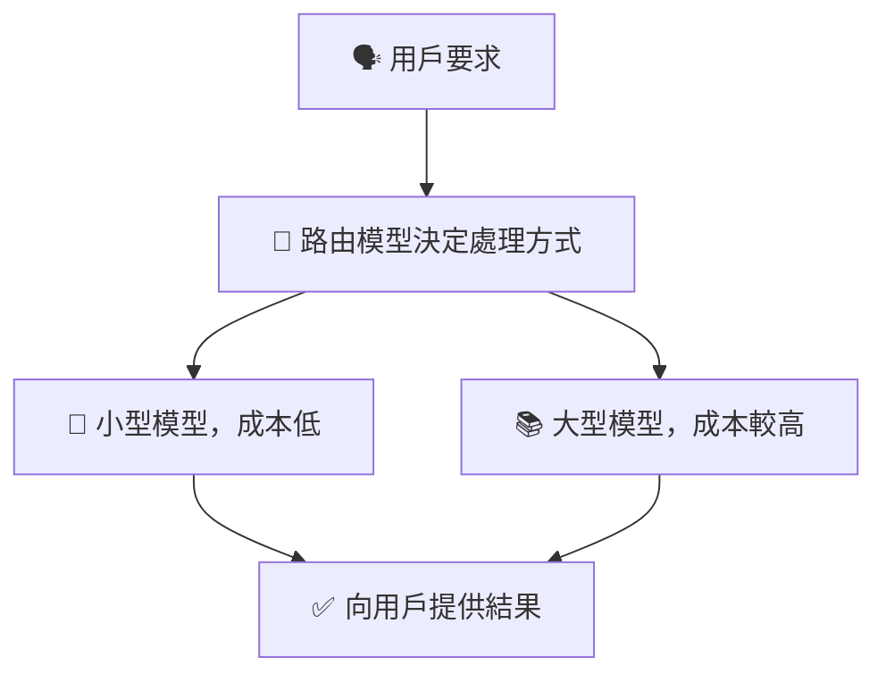
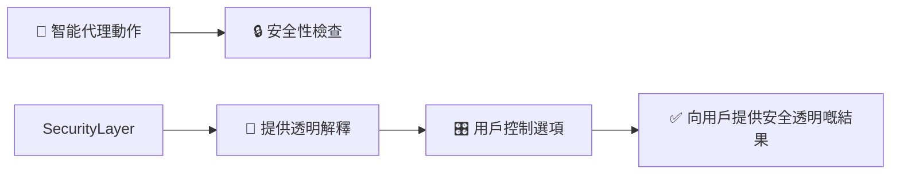

# 🚀 AI 智能代理生產部署指南（簡單易明版）

---

## 📌 **咩係智能代理部署（AI Agent Deployment）？**

智能代理部署係指將AI智能代理正式推出到真實環境，畀用戶直接使用。透過呢個部署過程，智能代理可以穩定、安全同有效率咁為用戶提供服務。

---

## 🎯 **智能代理部署嘅重要目標**

| 目標 | 解釋 |
|------|-------------|
| 📈 **有效規劃** | 確保部署前做好準備，順利推出 |
| 🐞 **避免常見錯誤** | 預防常見嘅部署問題，順利執行 |
| 💲 **控制成本** | 平衡代理效能同運作成本 |

---

## 🛠️ **智能代理部署嘅主要考慮因素**

要順利部署智能代理，需要考慮以下因素：

| 因素 | 說明 |
|------|-------------|
| 🎯 **清晰嘅目標** | 明確智能代理要完成嘅任務 |
| 🐞 **避免常見錯誤** | 提前識別同預防常見嘅問題 |
| 💸 **成本管理** | 控制使用資源同降低成本 |

---

## 🌟 **智能代理運作流程**

智能代理一般運作流程可分為四個主要步驟：

### 📌 **智能代理評估同回饋流程圖：**

---

## 🚨 **部署智能代理時嘅常見問題同解決方法**

部署智能代理會遇到以下常見問題：

| 問題 | 解決方案 |
|---------------|-----------|
| 🔄 **代理無限循環** | 設定明確嘅終止條件，避免死循環 |
| 🎯 **目標唔清晰** | 使用清晰易明嘅任務指引 |
| 🤯 **任務負載過重** | 將任務分拆畀多個智能代理處理 |

---

## 💸 **有效控制智能代理嘅成本**

要控制成本，同時保持智能代理高效運作，可以使用以下方法：

| 方法 | 解釋 | 實際例子 |
|----------|-------------|-------------------|
| 📦 **快取資料** | 減少重複資料查詢 | 快取常用查詢結果 |
| 📘 **使用細型語言模型（SLMs）** | 簡單任務用較細嘅AI模型 | 基礎問答使用較低成本模型 |
| 🔀 **使用路由模型** | 將任務高效分配至唔同嘅模型或代理 | 將複雜任務分配給較大嘅模型 |

### 📌 **智能代理成本管理流程圖：**

---

## 🔑 **部署智能代理嘅安全注意事項**

部署智能代理一定要注意安全同透明度：

| 注意事項 | 說明 | 實踐建議 |
|---------------|-------------|---------------|
| 🔐 **安全措施** | 保護資料同使用工具 | 使用安全API、限制存取權限 |
| 📖 **透明解釋** | 提供明確嘅解釋，建立用戶信任 | 透明說明代理做出決定嘅原因 |
| 🎛️ **用戶控制** | 用戶可管理自己嘅資料同代理偏好 | 提供資料管理功能 |

### 📌 **安全與透明度嘅示意圖：**

---

## 📚 **重點回顧**

- 部署智能代理要考慮有效規劃、避免常見問題同成本管理。
- 使用較小嘅模型、路由器同緩存技巧有效控制成本。
- 智能代理框架可簡化部署過程，同時強化安全及透明度。

---

## 🌟 **更多參考資源**

- [Azure AI Agent服務官方文檔](https://learn.microsoft.com/azure/ai-services/agents/overview)
- [Semantic Kernel 官方教學](https://learn.microsoft.com/semantic-kernel/frameworks/)
- [AutoGen 官方文件](https://microsoft.github.io/autogen/)